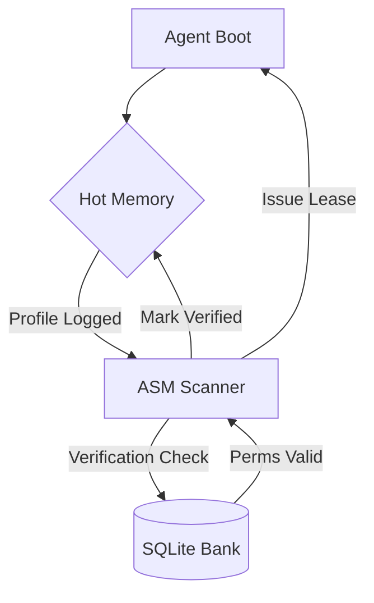

# Component: Agent Session Manager (ASM)

## 1. High-Level Summary
- **Component Name:** Agent Session Manager
- **Primary Role:** Manages the lifecycle, verification, and lease-holding of all active Koad Agents.
- **Plane:** Agents (Orchestration)

## 2. Mermaid Visualization

## 3. Interfaces & Contracts
### 3.1. Inputs (Listens To)
- **Redis:** `koad:sessions` PubSub channel
- **SQLite:** Identity and Permission tables

### 3.2. Outputs (Broadcasts / Returns)
- **Redis:** Updates `koad:session:ID:status`
- **Redis:** Publishes verification events

## 4. State Management
- **Stateless/Stateful:** Stateful (Orchestration State)
- **Storage:** Persistence in SQLite; Active state mirror in Redis.

## 5. Failure Modes & Recovery
- **Known Failure States:** Orphaned sessions, expired leases.
- **Recovery Protocol:** Autonomic Reaper prunes dark sessions after 30s of heartbeat silence.
