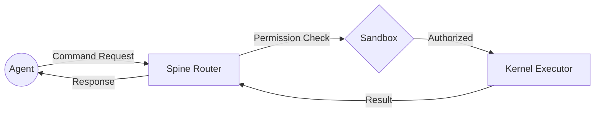

# Component: Autonomous Spine (The Router)

## 1. High-Level Summary
- **Component Name:** Autonomous Spine
- **Primary Role:** Serves as the central Control Plane router for strict, deterministic system commands.
- **Plane:** Control Plane (gRPC)

## 2. Mermaid Visualization

## 3. Interfaces & Contracts
### 3.1. Inputs (Listens To)
- **gRPC:** SpineService RPC Methods (Execute, Hydrate, PostEvent)
- **Payload:** Proto-defined Request Objects

### 3.2. Outputs (Broadcasts / Returns)
- **gRPC:** Response Objects
- **Redis:** Publishes mutation events to `koad:telemetry`

## 4. State Management
- **Stateless/Stateful:** Stateless (The Spine is a router; state lives in Redis/SQLite)
- **Storage:** N/A

## 5. Failure Modes & Recovery
- **Known Failure States:** Port bind failure, gRPC panic.
- **Recovery Protocol:** PID Guard prevents ghost instances; Systemd/Watchdog restarts binary.
