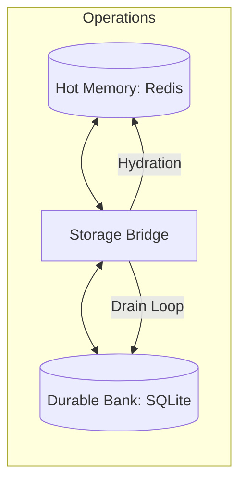

# Component: Storage Bridge (Memory Bridge)

## 1. High-Level Summary
- **Component Name:** Storage Bridge
- **Primary Role:** Manages the bidirectional synchronization between the high-speed Hot Memory (Redis) and durable Long-Term Memory (SQLite).
- **Plane:** Storage Tier

## 2. Mermaid Visualization

## 3. Interfaces & Contracts
### 3.1. Inputs (Listens To)
- **Redis:** Reads all transient state (Telemetry, Sessions, Intel).
- **SQLite:** Reads historical state during boot.

### 3.2. Outputs (Broadcasts / Returns)
- **SQLite:** Writes finalized session logs and knowledge fragments.
- **Redis:** Restores state during **Autonomic Hydration**.

## 4. State Management
- **Stateless/Stateful:** Stateful (Transition point).
- **Storage:** SQLite (Primary Source of Truth for durable state).

## 5. Failure Modes & Recovery
- **Known Failure States:** SQLite lock contention, Redis UDS failure.
- **Recovery Protocol:** Uses a **Write-Ahead Log (WAL)** for SQLite; exponential backoff for Redis reconnection.
