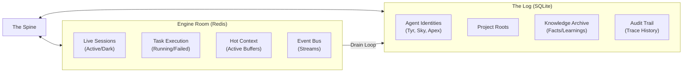

# v5.0 Engine Room — State Authority

> [!CAUTION]
> **Primary Directive:** No Redis = No Session.
> Redis is the absolute authority for real-time station state. The Spine is stateless and MUST query Redis for every request.

---

## 1. Hot State vs. Durable Memory
We eliminate the "Split-Brain" flaw by strictly partitioning data based on its lifecycle.

---

## 2. Redis Key Schema (The Truth)

| Pattern | Type | Content |
| :--- | :--- | :--- |
| `koad:sessions:{sid}` | Hash | Full serialized `AgentSession` object. |
| `koad:identities:leases` | Hash | `{agent_name} -> {sid}` (The Identity Lock). |
| `koad:stream:telemetry` | Stream | Station resource usage & health signals. |
| `koad:stream:events` | Stream | Global event bus for all systems. |

## 3. SQLite Schema Mandate (Sovereign Mind)
The Spine's `SchemaManager` enforces the following tables at boot, including **Anti-Deletion Triggers**:
- **`knowledge`**: `(category, content, tags, origin_agent, timestamp, is_deleted)`.
    - **Trigger:** An `ON DELETE` trigger that redirects all delete attempts to the `audit_trail` and raises a `SQLITE_ERROR` if the user is not `Admiral`.
- **`identities`**: Persistent agent configurations.
- **`audit_trail`**: Immutable log of all Trace IDs and data mutations.

## 4. Atomic Handoffs & Resilience
- **Vaulting:** Automated encrypted backups are stored in `.koad-os/backups/vault/`.
- **Recovery:** In the event of a total station failure, the station can self-reconstruct the `knowledge` table by re-playing the **WORM Ledger**.

---
*Next: [The Spine Backbone — Orchestration](SPINE_BACKBONE.md)*
