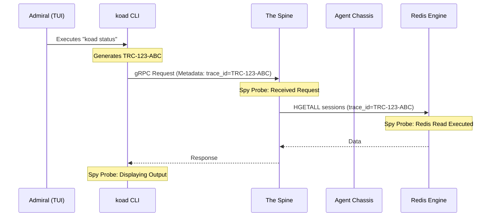

# v5.0 Total Station Observability & Tracing

> [!IMPORTANT]
> **Primary Mandate:** "No Blind Corners."
> Every system component is instrumented with **Spy Probes** that report to the **Signal Corps**. We don't just log errors; we trace the entire lifecycle of every intent.

---

## 1. The "Spy Device" Architecture
We move away from passive logging to active instrumentation. Every critical path is wrapped in a **Probe**.

### **A. The Execution Spy (Shell & I/O)**
Any time an agent runs a tool (shell command, file read/write), the **Execution Spy** captures:
- **Input:** The exact command or data.
- **Environment:** The working directory and active `.env`.
- **Duration:** Execution time in milliseconds.
- **Outcome:** Exit code and peak memory usage.
- **Signal:** Pushed to `koad:stream:telemetry` with the `trace_id`.

### **B. The gRPC Interceptor (Neural Bus Spy)**
A middleware layer in the Spine that "spies" on every incoming and outgoing message.
- Captures payload size and serialization latency.
- Validates the `trace_id` presence.
- Reports "Dropped Signals" if a client disconnects prematurely.

### **C. The Engine Room Probe (Redis/SQLite Spy)**
Instruments the `StorageBridge`.
- **Redis:** Tracks key-hit ratios and latency of Lua scripts.
- **SQLite:** Monitors WAL size and query execution plans.
- **Distress Signal:** If a database write takes >100ms, a high-severity "Friction Alert" is emitted.

---

## 2. The Trace ID Propagation Chain
The `trace_id` is the connective tissue. It is never dropped.

---

## 3. Self-Reporting & Distress Signals
Components do not fail silently. They emit **Distress Signals** to the **Event Bus**.

- **Signal Severity:** `DEBUG` | `INFO` | `WARN` | `DISTRESS` (Internal Error) | `CRITICAL` (System Outage).
- **Auto-Escalation:** The **Signal Corps** monitors for `DISTRESS` signals. If a component emits 3 signals in 10 seconds, it triggers a **"Station-Wide Red Alert"** visible in the TUI and Web Deck.

---

## 4. Verification & Testing (The "Spy Test" Standard)
Every "spy device" must be verifiable. We implement **Functional Verification Tests (FVT)**.

1. **The Probe Test:** A test that purposefully triggers a slow Redis query or a shell failure and verifies that the correct `trace_id` and `Signal` appear in the Redis Stream.
2. **The Chain Test:** Verifies that a `trace_id` generated in the CLI successfully reaches the `audit_trail` table in SQLite after passing through the Spine and Redis.
3. **The Heartbeat Mock:** Simulates a crashed agent and verifies the **Autonomic Watchdog** detects the "Missing Pulse" and emits a `DISTRESS` signal.

---

## 5. Visualizing the Spy Network
The Admiral can "tap into" any probe in real-time:
- `koad dood spy --component spine`: Shows raw gRPC traffic for the current session.
- `koad dood spy --trace <id>`: Reconstructs the complete historical path of that ID.
- `koad dood spy --engine`: Displays real-time Redis/SQLite performance metrics.

---
*Next: Final System Consolidation & The v5.0 Master Specification.*
