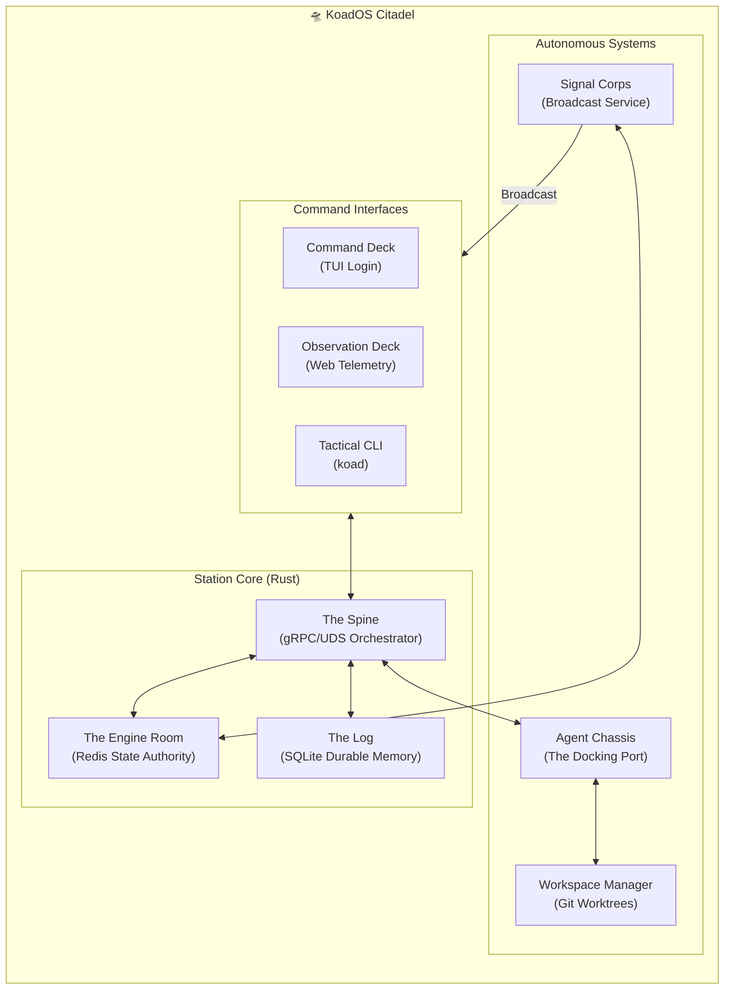

# KoadOS v5.0 — The Citadel Architecture

> [!IMPORTANT]
> **Metaphor:** The Docking Station.
> KoadOS provides the physical infrastructure (The Dock) where raw AI models (The Intelligence) plug in to become specialized Crew Members (Tyr, Sky, Apex).

---

## 1. High-Level Orchestration
The Citadel is composed of five specialized systems working in concert. Communication is driven by a strictly-typed **Neural Bus** (gRPC) and a real-time **Event Bus** (Redis Streams).

---

## 2. The Five Systems

| System | Role | Authority |
| :--- | :--- | :--- |
| **1. Dock Runtime** | The always-on backbone managing gRPC and local UDS sockets. | Spine |
| **2. Agent Chassis** | Manages the agent lifecycle (Docking -> Teardown) and context hydration. | Redis |
| **3. Workspace Manager** | Physically isolates agents using Git Worktrees to prevent path collisions. | Filesystem |
| **4. Event Bus** | Propagates awareness via emitters and listeners (Signal Corps). | Redis Streams |
| **5. Interface Deck** | Provides professional-level visibility (TUI/Web) and station-wide tracing. | Admiral |

---

## 3. Design Principles
1. **Token Austerity:** Pre-compute and pre-format context to minimize agent token usage.
2. **Atomic State:** No fragmented truth. If it isn't in Redis, it isn't happening.
3. **Type Sovereignty:** Strict Protobuf contracts for every boundary crossing.
4. **Active Diagnostics:** Continuous E2E functional probing (`koad doctor`).

---
*Next: [The Engine Room — State Authority](ENGINE_ROOM.md)*
