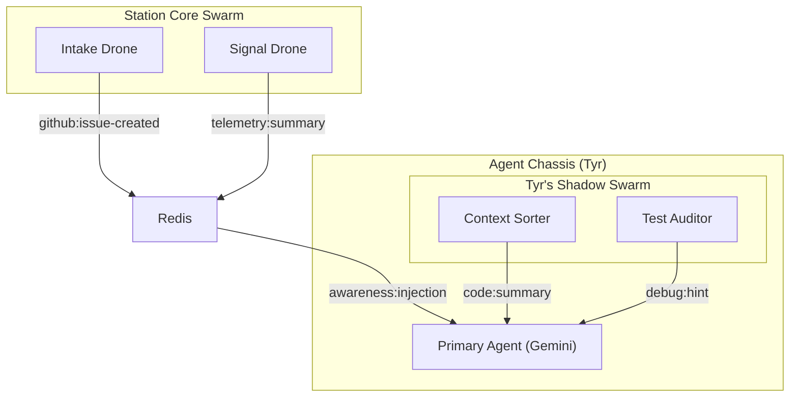

# v5.0 Swarm Intelligence & Resource Orchestration

> [!IMPORTANT]
> **Core Mandate:** "Strength in Numbers, Efficiency in Execution."
> Every docked Agent (Tyr, Sky) is supported by a personal **Sub-Swarm**. The Station itself maintains a **Core Swarm** for global operations. Local models (Ollama) are used to handle fuzzy tasks, keeping high-tier agents in a state of pure reasoning.

---

## 1. The Swarm Hierarchy

### **A. The Station Swarm (Core)**
*Role:* Global station management and SLE monitoring.
- **The Intake Drone:** (Ollama 7B) Listens to the Idea Queue and constructs GitHub issues.
- **The Signal Drone:** (Ollama 1B/3B) Monitors logs and event streams, emitting high-signal "Situation Reports."
- **The SWS Scout:** (Ollama 3B) Specifically assigned to the SLE to map Cloud Functions and monitor production/sandbox drift.

### **B. The Agent Sub-Swarms (Shadows)**
*Role:* Supporting a primary docked agent during a session.
- **The Context Sorter:** Pre-filters file reads and summarizes large codeblocks before the primary agent (Tyr/Sky) sees them.
- **The Test Auditor:** Analyzes test failure logs and suggests specific lines of code to investigate.
- **The Reflection Drone:** Handles the "Introspection" phase during teardown, committing learnings to SQLite so the primary agent doesn't pay the token cost.

---

## 2. Resource Management (The Laptop Profile)
With 64GB RAM and no dedicated GPU (currently), we must employ **Lazy Swarm Activation**.

- **Dynamic Loading:** Only drones belonging to *active* sessions are loaded into memory.
- **Quantization Mandate:** Station drones use 4-bit quantization (Q4_K_M) to minimize VRAM/RAM footprint.
- **Priority Queue:** If multiple agents trigger drones simultaneously, the Spine queues the local inference requests to prevent CPU thrashing.
- **The "Desktop Profile" Hook:** The system is designed to detect the presence of an RTX card. When your desktop is active, the swarm automatically upgrades to higher-parameter models (e.g., 14B or 32B) for deeper analysis.

---

## 3. Communication: The Hive Mind
Drones communicate via the **Redis Event Bus**.

## 4. Implementation Blueprint
1.  **Drone Templates:** Standardized system prompts for each drone type stored in `blueprints/swarms/`.
2.  **Ollama Dispatcher:** A module in `koad-core` that manages concurrent requests to the local Ollama API.
3.  **Shadow Swarm Lifecycle:** Updated `koad boot` to also spin up the supporting drone listeners for the specific persona.

---
*Commanded by Captain Tyr, Powered by the Swarm.*
