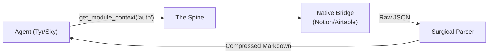

# v5.0 Tool Layer — Surgical Parsers

> [!IMPORTANT]
> **Core Role:** The Tool Layer provides agents with "Sharp Tools"—specialized interfaces that do maximum work per invocation while minimizing token consumption.

---

## 1. The Anti-MCP Philosophy
Generic tools (like the standard Notion MCP) return massive JSON objects with 90% metadata. This is a "Token Tax."

**The v5.0 Standard:** 
Tools MUST perform **Surgical Parsing**—stripping all non-essential metadata and formatting the output as compressed Markdown *before* it reaches the agent.

## 2. The "Sharp Tool" Pattern
We replace generic file/API access with **Context-Rich Composite Tools**.

### **Example: `get_module_context`**
Instead of the agent calling `ls`, then `cat file1`, then `cat file2`, it makes ONE call.
- **Output:** A single Markdown block containing:
    - Recent changes to the module.
    - Active issues related to the module.
    - High-level code summary.
    - Relevant test results.

## 3. Native Rust Bridges
We are deprecating external MCP servers in favor of native Rust crates within the KoadOS workspace.
- **`koad-bridge-notion`**: (Complete) Surgical Markdown parsing of pages.
- **`koad-bridge-airtable`**: (Planned) Schema-aware record extraction.
- **`koad-bridge-gcloud`**: (Planned) Log-filtering and Function-mapping.

## 4. The Token Budget Mandate
Every tool design must include a **Token Estimate**.
- **Target:** Core station awareness (Identity + Last 5 Events) should fit under **1,000 tokens**.
- **Strategy:** Use Ollama (micro-agents) to pre-summarize long logs before injecting them into a high-tier agent (Tyr/Sky) context.

---
*Next: Final Documentation Synthesis.*
