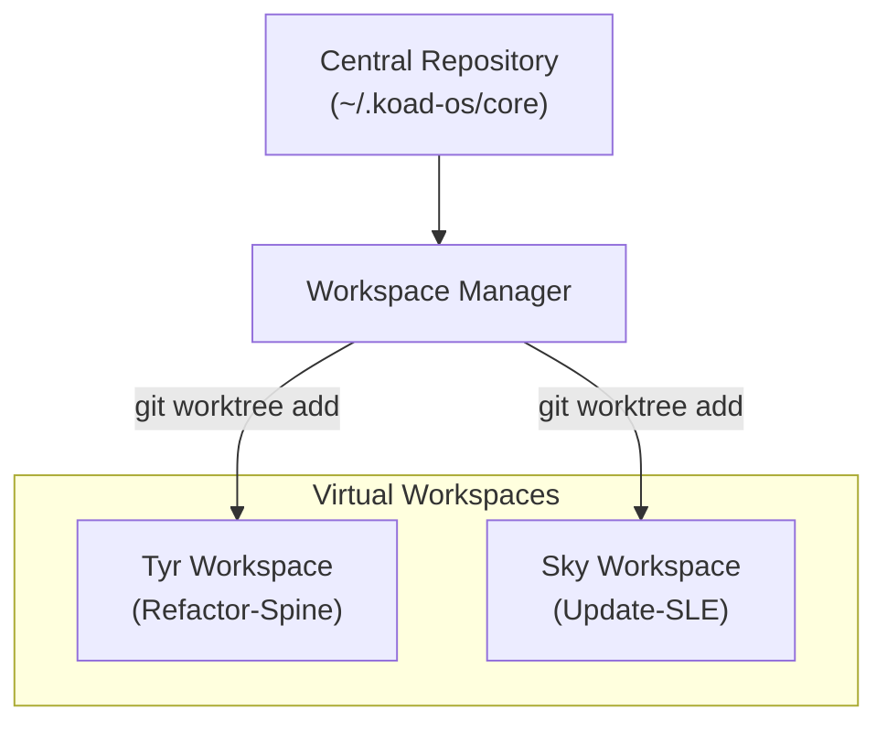

# v5.0 Workspace Manager — Git Isolation

> [!IMPORTANT]
> **Core Role:** The Workspace Manager manages the physical filesystem where agents operate. It uses Git Worktrees to provide isolated, parallel environments for every agent task.

---

## 1. Isolation Strategy: Git Worktrees
We eliminate file-system contention by ensuring that no two agents ever operate in the same physical directory.

## 2. Directory Structure
Workspaces are transient and namespaced by session:
`~/.koad-os/workspaces/{agent_name}/{trace_id}/`

## 3. The Task Handoff
1. **Assign:** Admiral runs `koad assign sky SG-142`.
2. **Setup:** WSM creates a worktree and a dedicated branch `sky/SG-142`.
3. **Sandbox:** For **Sky (Officer)**, WSM injects `.env.sandbox` into the worktree.
4. **Boot:** Sky boots directly into that folder. She cannot see or touch the Admiral's primary directory.

## 4. Teardown & PR Logic
Agents do not push to `main`. 
- **Validation:** When an agent marks a task `Success`, the Spine triggers a build/test run in the worktree.
- **Submission:** If tests pass, the Spine executes `git commit` and `gh pr create` from the worktree.
- **Cleanup:** Upon PR merge, WSM executes `git worktree remove` and nukes the folder.

---
*Next: [The Interface Deck — Command & Observation](INTERFACE_DECK.md)*
