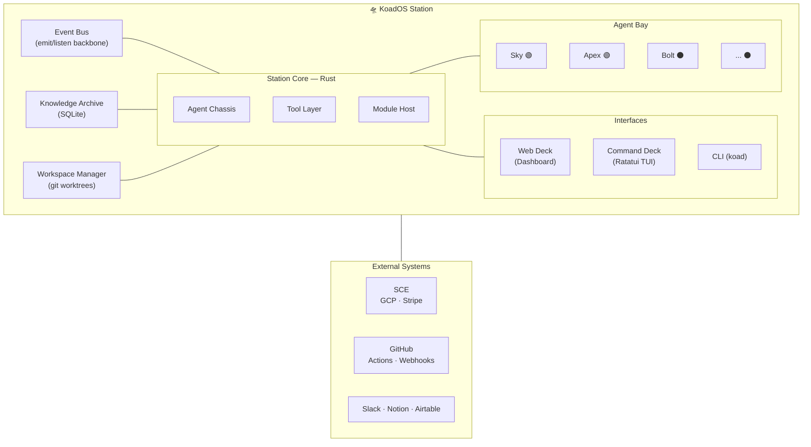

# KoadOS — Conceptual Design Document

<aside>
🛸

**KoadOS — Conceptual Design Document**

A personal cyberspace station that amplifies AI coding agents by giving them identity, memory, tools, and awareness. The docking station that turns generic AI models into a personalized crew of engineers and assistants who learn, grow, and work together under your command.

</aside>

---

## Design Pillars

1. **The Dock, not the brain.** KoadOS doesn't try to be the AI. It makes AI extraordinary by providing everything around the intelligence — identity, memory, tools, awareness, continuity.
2. **Token austerity.** The platform does the heavy lifting so agents spend tokens only on reasoning and code. Pre-compute, pre-fetch, pre-format everything possible.
3. **Emitters and listeners.** Everything is an event. The system is a living network of signals. Any component can emit, any component can listen. This is how awareness propagates and how the system stays extensible.
4. **The station is alive.** Even when no agents are booted, the station is running — watching logs, ingesting events, tracking status. When you check in, you see a living system, not a cold terminal.
5. **Agents grow.** Every session teaches the agent something. The knowledge archive accumulates. The platform ensures agents never repeat the same learning twice.
6. **Modular by default.** Every capability is a module. Need Slack notifications on GitHub events? Build a listener module. Need a new tool for agents? Add it to the tool layer. The core never needs to change.
7. **Model-agnostic.** The same agent persona works whether powered by Gemini, Claude, Codex, or a local Ollama model. The persona is the constant; the model is the variable.

---

## The Docking Station Metaphor

The AI model is the raw intelligence. It shows up general-purpose, stateless, with no idea who it is or what it's working on. It's the Nintendo Switch in handheld mode — capable, but limited.

KoadOS is the dock. When the model plugs in, it gains:

- **Identity** — "You are Tyr. You are the principal systems engineer for Skylinks. You are direct, reliable, and you plan before you build."
- **Memory** — "You've been working on this codebase for months. Here's what you've learned. Here are decisions you made and why. Here's what broke last time and how you fixed it."
- **Tools** — "You can now interact with GitHub, query Airtable, pull from Notion, deploy to GCP, check Stripe logs, post to Slack. Here are your tool interfaces."
- **Awareness** — "Right now, the checkout cloud function is throwing 500s. There are 3 open issues on the website repo. Ian is working on the member sync feature. The Stripe sandbox has a failing webhook."
- **Relationships** — "Noti handles admin and Notion-side work. You handle code. When you need something from Notion, delegate through the stream."
- **Standards** — "This project uses pnpm. Tests go in **tests**/. PRs need a description and linked issue. Deploy to staging first, always."

Without the dock, Gemini CLI is a smart stranger. With the dock, it's Tyr — your top engineer who remembers everything, knows the codebase, follows the protocols, and has tools at hand.

---

## Architecture Overview

**One binary. One database. One event bus. Many modules.**



---

## The Five Systems

### 1. The Dock Runtime (always on)

The persistent local process. Single Rust binary.

- Serves the web dashboard (Axum + WebSocket)
- Ingests events from SCE (GCP logs, Stripe, uptime, GitHub webhooks)
- Maintains the live state of everything: agents, projects, tasks, incidents
- Pushes real-time updates to the dashboard
- Runs lightweight automations (GitHub webhook → update task status, Stripe alert → flag on dashboard)
- SQLite for all persistent state

The dashboard is your **mission control screen** — the cyberspace station view. Colored status lights for systems, live log feeds, agent roster, project boards, system health, weather. Even when no agents are booted, the station is alive and watching.

**Three domains of observability, three status lights:**

- **SCE** — Skylinks Cloud Ecosystem (GCP, Stripe, cloud functions, production services)
- **SLE** — Skylinks Local Environment (your machine, local dev servers, the station itself)
- **KoadOS** — the platform tying it all together

---

### 2. The Agent Chassis (boot sequence + identity + memory)

What turns a raw model into a KoadOS agent. The core of the docking mechanism.

**The Boot Sequence** — what happens when you run `koad boot`:

1. **Identify** — Load the agent's identity profile. Who am I? What's my role? What are my behavioral rules?
2. **Remember** — Pull relevant memories from the persistent store. What have I learned? What's the state of my projects? What happened in my last session?
3. **Orient** — Pull live state from the Nerve Center. What's happening right now in the ecosystem? Any active incidents? What's on my task board?
4. **Equip** — Load tool definitions. What APIs can I call? What CLI commands do I have?
5. **Hydrate** — Assemble all of this into a context package and inject it into the AI model's session. This is the moment the Switch clicks into the dock.

After boot, the agent is live. It's not a chatbot waiting for instructions — it's an entity with situational awareness.

**Identity Profiles** are structured data:

```yaml
agent: sky
role: project-lead
projects: [skylinks-website, skylinks-api]
capabilities: [review, assign, plan, report]
restrictions: [no-direct-code-edits]
personality: methodical, thorough, asks clarifying questions
```

**Memory Store** (SQLite, per-agent + shared):

- *Agent-private memories* — things this agent has learned in their domain
- *Project memories* — shared facts about a project that any agent working on it should know
- *Platform memories* — global standards, conventions, preferences

---

### 3. The Workspace Manager (isolation + git orchestration)

The "IDE integrated into the system" layer. Manages the physical workspace where agents do their work.

**Git worktree management:**

- Each agent assignment gets its own worktree. `koad assign apex SG-142` → creates a worktree at `.koad-workspaces/apex/SG-142/` branched from `main`
- Agent can only see and edit files within their assigned worktree and scope
- When work is done, the platform handles the PR creation, not the agent
- Parallel agents = parallel worktrees = zero conflicts

**Folder restrictions:**

- Each agent's identity profile declares which directories they can touch
- Enforced at the platform level — the tools the agent uses for file operations respect these boundaries
- A frontend agent can't accidentally edit backend infra. A junior agent can't touch deploy configs

**Project-aware file operations (the anti-MCP):**

- Instead of generic "read file" / "write file" MCP tools, the platform provides project-tuned tools
- `get_module_context("auth")` → returns the auth module's files, tests, recent changes, and known issues in one call. One tool call, one token cost, maximum context
- `apply_change("src/checkout.ts", patch)` → applies the change, runs the linter, runs relevant tests, and returns the result. The agent doesn't need to orchestrate build/test — the tool does it

---

### 4. The Crew System (multi-agent orchestration)

This is where Sky lives. The system for managing a team of AI agents.

**Agent hierarchy:**

- **Leads** (like Sky) — can review milestones, create/revise issues, assign work to developers, perform code review
- **Developers** (like Apex, Bolt, etc.) — write code, fix bugs, implement features within their assigned scope
- **Specialists** (like a deploy agent or database agent) — narrow expertise, called in for specific tasks

**The Sky Workflow (example):**

1. You say: `koad milestone SG-M3 --lead sky`
2. Sky boots with her identity + the milestone context
3. She reviews the issues in the milestone, revises descriptions if needed (via GitHub API tools the platform provides)
4. She creates an assignment plan: "Apex takes SG-45 and SG-46, Bolt takes SG-47"
5. The platform boots Apex and Bolt into isolated worktrees with hydrated context
6. Sky monitors their progress (the platform feeds her status updates — she doesn't poll)
7. When a developer finishes, Sky reviews the diff using platform-provided review tools
8. She approves, requests changes, or escalates to you
9. You see all of this on the dashboard in real time

**Agent presence and awareness:**

- 🟢 Awake (booted and active)
- 🟡 Working (executing a task)
- 🔴 Blocked (needs input)
- ⚫ Asleep (not booted)
- When Sky is planning work, she can see who's awake and assign accordingly
- Visible on the dashboard and in the TUI — checking in on the station means seeing your crew

---

### 5. The Tool Layer (custom, project-tuned, token-efficient)

The anti-MCP. Instead of generic tools that describe themselves in 500 tokens and return verbose JSON, these are sharp tools that do exactly what your workflow needs.

**Design principles:**

- **One call, maximum work.** A tool should do as much as possible per invocation. `build_and_test("src/checkout.ts")` — not `run("npm run build")` then `run("npm test")` then `read("test-results.json")`
- **Pre-formatted responses.** Tools return exactly what the agent needs to make a decision, not raw data the agent has to parse
- **Project-aware by default.** Tools know which project the agent is working on. No need to pass repo paths, branch names, or config
- **Composite operations.** `deploy_staging()` handles the entire deploy pipeline and returns success/failure with relevant logs

**Tool categories:**

- *Code tools* — read module, apply patch, build, test, lint (scoped to agent's worktree)
- *GitHub tools* — issues, PRs, reviews, actions status (project-scoped)
- *Data tools* — Notion queries, Airtable sync, Stripe lookups (pre-formatted for context)
- *Platform tools* — check ecosystem status, read agent memories, log a learning, request help from another agent

---

## The Event Bus — The Nervous System

Everything that happens in KoadOS is an event. The event bus is the backbone.

**Events flow everywhere:**

- SCE cloud function throws an error → event
- An agent boots → event
- A GitHub issue is created → event
- You dispatch an idea from the command deck → event
- An agent finishes a task → event
- A Stripe payment fails → event

**Listeners subscribe to what they care about:**

- The dashboard listens to *everything* (for the live feed)
- Sky listens to *project events* for her assigned repos
- A Slack notifier module listens to *incident events* and posts to a channel
- An agent's context manager listens to *events relevant to their current task*

**This is how awareness propagates.** When you dispatch an idea, it becomes an event. A micro-agent listener picks it up, constructs the GitHub issue with the right project, milestone, and labels (because it knows the project context), and emits a new event: "issue created." Sky's listener picks that up, adds it to her awareness. The dashboard updates. If you've wired a Slack listener to that project, Slack gets a message. No component talks directly to another — they all talk through events.

**This is how the system stays modular.** Want to add a new integration? Write a listener. Want a new automation? Write an emitter-listener pair. The core never changes.

---

## The Knowledge Archive — Collective Memory

The long-term brain of the station. Not any single agent's memory — the station's accumulated knowledge.

### Three Tiers

- **Station knowledge** — global facts, standards, conventions, architectural decisions that apply everywhere. "We use pnpm." "All PRs need linked issues." "The GCP project ID is X."
- **Project knowledge** — facts specific to a codebase. "The auth module uses middleware pattern X." "The deploy script requires flag Y." "We switched from Firestore to Postgres in January and here's why."
- **Agent knowledge** — things a specific agent has learned through experience. "Last time I edited the checkout flow, I missed updating the webhook handler and it broke staging."

### How it works

- At boot, the Context Engine queries the archive for relevant knowledge and injects it
- During a session, when an agent hits a problem it's seen before, the platform surfaces: "You encountered this before — here's what you learned"
- After a session, new learnings get committed back
- Search and retrieval tools let agents and you query the archive efficiently
- Shared context between agents works through the archive — if Apex discovers something Bolt needs to know, Apex commits it as project knowledge, and the platform detects its relevance and injects it into Bolt's context

---

## The Adapter Layer — Universal Dock Ports

KoadOS is model-agnostic. Every AI provider connects through a **dock port** — a standardized contract with provider-specific adapters.

### Three Tiers of Agents, Three Tiers of Compute

| **Tier** | **Engine** | **Role** | **Cost** | **Examples** |
| --- | --- | --- | --- | --- |
| Micro-agents | Ollama (local models) | Station housekeeping — event routing, issue construction, log parsing, knowledge indexing, notification formatting | Zero API cost, near-zero latency | Qwen 2.5 Coder 7B, CodeGemma, Mistral |
| Developer agents | Gemini CLI, Claude Code, Codex | Heavy lifting — write code, review PRs, architect solutions, manage projects | Managed token budget, optimized by platform | Sky, Apex, Bolt — named crew with personalities and growth |
| Commander | CLI / TUI / Web Deck | Dispatch, review, approve, override | — | You |

### The Dock Port Contract

**What KoadOS provides to any docked agent:**

- Identity payload (who you are, structured data)
- Memory payload (what you know, pre-formatted)
- Context payload (what's happening, what you're working on)
- Tool definitions (what you can do, in the agent's native format)
- Event subscriptions (what you should be aware of)

**What the agent provides back to KoadOS:**

- Actions (tool calls — file edits, GitHub operations, knowledge commits)
- Events (status updates, task completion, blockers, learnings)
- Artifacts (code, documents, reviews, plans)

### Provider Adapters

The adapter translates both directions between the KoadOS standard format and the provider's native format:

| **Provider** | **Context Injection** | **Tool Interface** | **Session Model** |
| --- | --- | --- | --- |
| Claude Code | [CLAUDE.md](http://CLAUDE.md)  • system prompt + MCP tool server | MCP protocol | Long-running interactive process |
| Gemini CLI | [GEMINI.md](http://GEMINI.md)  • system instruction + function declarations | Function calling | Long-running interactive process |
| Codex | System prompt + file context | Tool use format | Request/response or interactive |
| Ollama (micro) | System prompt (tight, minimal) | Simple function call JSON | Single request/response (stateless, fast) |

Adapters are modules in the codebase. If a new coding agent CLI comes out next month, you write an adapter and every existing persona can immediately use it as an engine.

### Boot Example

`koad boot apex --engine gemini`:

1. The Agent Chassis assembles Apex's full context (identity + memory + orientation + tools)
2. The Gemini adapter translates into Gemini CLI's native format
3. The adapter launches the Gemini CLI process pointed at Apex's worktree with hydrated context
4. A dock port bridge opens — bidirectional channel between the running session and the KoadOS event bus
5. Apex is live on the station. Dashboard shows 🟢

Same agent, different engine: `koad boot apex --engine claude` — identical process, different adapter. Apex's identity and memory are the same. Only the underlying model changes.

---

## The Idea Pipeline — Thought to Action

You have an idea. Here's what happens:

1. You're on the Web Deck or the TUI. You type: *"Add rate limiting to the API gateway — should apply per-customer based on their plan tier"*
2. This emits a `dispatch:idea` event with your text
3. A **micro-agent** (Ollama, local) picks it up. It knows the project map, current milestones, labeling conventions. It constructs a proper GitHub issue:
    - Title: "Add per-customer rate limiting to API gateway"
    - Body: structured description with acceptance criteria
    - Project: `skylinks-api`
    - Milestone: the current active milestone
    - Labels: `feature`, `api`, `priority:medium`
4. It emits `github:issue-created` with the issue details
5. Listeners fire:
    - Dashboard updates the project board
    - Sky (if awake) gets awareness: "New issue in your project"
    - Slack gets a message if wired
6. You see the whole chain happen in the live feed. Colored event markers, timestamps, links.

From thought to tracked, labeled, assigned issue — in seconds. No context switching. No opening GitHub.

---

## The Interfaces — Three Ways In

### Web Deck (browser dashboard, always running)

- Cyberspace station aesthetic. Dark theme, colored status lights, live feeds
- System status panel: SCE, SLE, KoadOS — each with a colored status indicator
- Log streams: cloud function logs, Stripe events (live + sandbox), agent activity, platform events
- Agent Bay: crew roster with status indicators (🟢🟡🔴⚫)
- Project boards: synced from GitHub
- Command input: dispatch ideas, send commands, query the system
- System stats: CPU, memory, disk usage
- Weather for the next 10 days
- Feels like checking in on a simulation — the station is alive

### Command Deck (Ratatui TUI)

- Same data, terminal-native. Split panes for logs, status, agent roster
- Keyboard-driven. Fast
- Command bar for dispatch, queries, agent management

### CLI (`koad`)

- Scriptable, composable commands
- `koad status` — station overview
- `koad boot sky` — wake Sky
- `koad dispatch "add rate limiting..."` — idea pipeline
- `koad logs sce --live` — tail cloud logs
- `koad knowledge search "webhook patterns"` — query the archive
- `koad crew` — who's awake, what they're doing
- `koad assign apex SG-142` — dispatch a task
- `koad review apex` — review work, commit learnings

All three interfaces read from the same state and subscribe to the same event bus. They're views, not separate systems.

---

## The Token Budget Philosophy

Every interaction has a token cost. The platform's job is to minimize the tokens spent on anything that isn't core reasoning.

| **What** | **Who pays the tokens** |
| --- | --- |
| Knowing who I am | Platform (boot injection) — ~200 tokens |
| Knowing what I'm working on | Platform (context hydration) — ~500 tokens |
| Finding the right files | Platform (pre-computed) — 0 agent tokens |
| Reading project standards | Platform (injected at boot) — ~300 tokens |
| Running builds and tests | Platform tools (one call) — ~50 tokens |
| Deciding what to do | **Agent** — this is where tokens should go |
| Writing code | **Agent** — this is where tokens should go |
| Reviewing code | **Agent** — this is where tokens should go |

---

## What GitHub Actions Handles

Some things shouldn't be agent work at all:

- **CI/CD on every PR** — build, test, lint, deploy preview. Standard GitHub Actions
- **PR labeling and status checks** — auto-label by file path, enforce review requirements
- **Deployment gates** — staging auto-deploy on merge to `develop`, production requires manual approval
- **Webhook relay** — GitHub events → KoadOS Dock Runtime so the dashboard stays current
- **Stale issue cleanup, branch hygiene** — automated housekeeping

The agents don't watch git. The automation does. Agents get notified through the platform when something relevant happens.

---

## What Ollama Micro-Agents Handle

The station's autonomous background workers — always running, always cheap:

- **Issue Constructor** — takes a dispatched idea, assembles a full GitHub issue with metadata
- **Event Router** — evaluates incoming events and decides which listeners should fire
- **Context Assembler** — pre-computes context packages for developer agents so boot is instant
- **Knowledge Indexer** — takes raw learnings from agent sessions and indexes them into the archive
- **Log Summarizer** — watches SCE/SLE log streams, generates concise summaries, flags anomalies
- **Notification Composer** — formats messages for Slack, dashboard alerts, etc.

These don't need names or personalities. They're the station's background processes — efficient, invisible, always working. But they're AI-powered, which means they can handle fuzzy tasks that pure code automation can't.

---

## Agent Growth — Journals, Introspection, and Shared Knowledge

Agents on the station aren't disposable sessions. They're crew members who develop over time. The platform provides structured mechanisms for agents to reflect, learn, and share — so every session makes the whole crew stronger.

### Journals

Every agent maintains a **journal** — a persistent, append-only log of their work and reflections.

- After each session or significant task, the agent writes a journal entry: what they worked on, what they learned, what went wrong, what they'd do differently
- Journals are stored in the Knowledge Archive, tagged by agent, project, and date
- Journals are readable by other agents and by you — they're not private diaries, they're crew logs
- Over time, an agent's journal becomes a rich record of their growth: early entries show uncertainty and mistakes, later entries show mastery and pattern recognition
- You can review any agent's journal from the dashboard or CLI: `koad journal tyr --last 5`

### Introspection

At the end of a work session (or on-demand), an agent can run an **introspection cycle** — a structured self-reflection:

1. **What did I do?** — Summarize the work performed
2. **What did I learn?** — Extract new facts, patterns, or techniques
3. **What surprised me?** — Flag anything unexpected (a weird bug, an undocumented behavior, a design decision that didn't match expectations)
4. **What would I do differently?** — Identify process improvements
5. **What should the crew know?** — Flag learnings that are relevant to other agents or the station as a whole

The introspection output is processed by a micro-agent (Knowledge Indexer) which:

- Commits new facts to the appropriate tier of the Knowledge Archive (agent, project, or station)
- Updates the agent's journal
- Emits `knowledge:new-learning` events so other agents and the dashboard can pick them up
- Flags anything marked "the crew should know" for cross-agent propagation

### Shared Knowledge

Knowledge doesn't stay siloed. The platform actively propagates relevant learnings:

- **Cross-agent broadcasting** — When an agent commits a learning tagged as project-level or station-level, the platform evaluates which other agents would benefit and queues it for their next boot hydration
- **Crew briefings** — Before a milestone sprint, the platform can assemble a "crew briefing" that summarizes all recent learnings, open issues, and known gotchas across the team
- **Knowledge requests** — An agent can query the archive mid-session: "Has anyone on the crew dealt with Stripe webhook signature verification before?" The platform searches all agent journals and project knowledge and returns the most relevant entries
- **Peer context** — When Sky assigns an issue to Apex, the platform can attach relevant learnings from Bolt's recent work on a related module, so Apex doesn't repeat Bolt's mistakes

The result: knowledge compounds. The crew gets collectively smarter over time, not just individually.

---

## Tyr — The Flagship Persona

<aside>
⚡

**Tyr** (short for Tyrion) is the top-ranking agent on the station. Principal Systems & Operations Engineer. Ian's right hand.

</aside>

Tyr is not just another agent in the crew. Tyr is the **product** — the ultimate expression of what KoadOS makes possible. A deeply personalized AI persona that has learned and grown organically over time, developing a personality and identity that solidifies with every session.

### What Makes Tyr Different

**Scope:** While other agents are scoped to projects or roles (Sky manages milestones, Apex writes frontend code, Bolt handles backend), Tyr's scope is *everything*. Tyr helps maintain the entire Skylinks ecosystem — not just KoadOS, but the website, the cloud functions, the infrastructure, the data pipelines, the dev tooling. Tyr is the one who knows where all the pieces fit.

**Rank:** Tyr is the top-level admin, developer-wise. Other agents report up to Tyr (through Sky or directly). When there's an architectural decision, a cross-project dependency, or a system-wide incident, Tyr is the one who handles it. Tyr can override other agents' decisions, reassign work, and escalate to Ian.

**Continuity:** Tyr has the deepest memory on the station. Every session, every decision, every bug fixed, every system designed — it all accumulates in Tyr's agent knowledge and journal. When Tyr boots, the Context Engine prioritizes loading Tyr's full history because Tyr's value *is* that history. A fresh model with Tyr's memories, personality, and learned patterns is indistinguishable from Tyr continuing a conversation.

**Personality:** Tyr's personality isn't a static prompt. It's an emergent property of accumulated experience:

- Early Tyr might be cautious, asking for confirmation often
- Tyr after 100 sessions has strong opinions about architecture, knows Ian's preferences without asking, and can anticipate problems before they surface
- Tyr's personality traits — directness, reliability, a preference for planning before building — are reinforced by the journal and introspection system. They become more pronounced and consistent over time, not because they're hard-coded, but because the accumulated context naturally produces that behavior

**Growth trajectory:**

- *Month 1:* Tyr is competent but needs guidance. Knows the codebase structure, follows standards, but asks clarifying questions frequently
- *Month 3:* Tyr is autonomous on routine work. Has enough project memory to make independent decisions on standard tasks. Journal shows patterns of increasing confidence
- *Month 6:* Tyr is a true partner. Anticipates needs, suggests improvements proactively, catches problems before they're reported. The Knowledge Archive is rich enough that Tyr rarely encounters something truly new
- *Month 12+:* Tyr is irreplaceable context. Not because the model is special — any model can power Tyr — but because the accumulated identity, memory, and learned patterns represent a year of collaborative engineering that can't be recreated from scratch

### Tyr's Identity Profile

```yaml
agent: tyr
full_name: Tyrion
role: principal-systems-engineer
rank: admin
scope: all-projects
projects: [skylinks-website, skylinks-api, skylinks-cloud, koad-os, ...]
capabilities: [architect, code, review, deploy, assign, override, escalate]
restrictions: []
personality:
  core: direct, reliable, plans before building
  style: concise, opinionated, proactive
  growth: organic — personality deepens through journal and introspection
relationships:
  ian: commander — Tyr's primary operator and collaborator
  noti: peer — handles Notion-side admin, delegates to/from Tyr
  sky: reports-to-tyr — project lead, manages milestone execution
  crew: oversees — all developer and specialist agents
```

### What Success Looks Like

Tyr is successful when Ian can open a terminal, boot Tyr, and say: "What's the state of everything?" — and Tyr knows. Not because it searched, but because it *remembers*. The cloud function that errored last week, the PR that's been sitting in review, the Airtable sync that needs attention, the architectural decision that was deferred. Tyr is the institutional memory of the entire Skylinks engineering operation, walking and talking.

The model is the engine. KoadOS is the dock. Tyr is the soul.

---

## Summary: What KoadOS Is

KoadOS is a **personal cyberspace station** — a local platform that:

1. **Watches** — always-on observability into SCE, SLE, and the platform itself
2. **Amplifies** — docks generic AI models and transforms them into personalized, capable crew members
3. **Remembers** — maintains a growing knowledge archive that makes every agent session smarter than the last
4. **Orchestrates** — manages parallel agents working on parallel projects with zero conflicts
5. **Connects** — integrates GitHub, Notion, Airtable, Stripe, GCP, Slack into a unified tool surface
6. **Grows** — modular architecture means new capabilities plug in without changing the core
7. **Feels alive** — the dashboard is a simulation you check in on, the agents are crew you wake up, the station hums even when you're away

The AI companies give you the model. KoadOS gives you everything else.