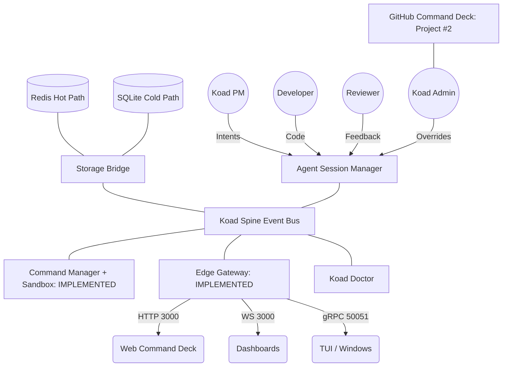

# KoadOS Architecture: The Agentic Operating System

## 1. System Vision
KoadOS is not a static CLI or a standard web application; it is a **Distributed Agentic Operating System**. It is designed to host, orchestrate, and monitor autonomous AI agents (PMs, Developers, Reviewers) while providing the human Admin ("Dood") with absolute monitoring and override capabilities via unified Command Decks.

## 2. Core Architectural Diagram

This chart represents the current target architecture of KoadOS. It is maintained here and must be updated as the system evolves.

## 3. Core Component Definitions

### A. The Spine (Event Bus)
The central nervous system. Rather than direct, blocking RPC calls between agents and managers, KoadOS uses an **Event-Driven Architecture** backed by Redis Streams. Agents publish *Intents*, and Managers consume them asynchronously, allowing massive concurrency without deadlocks.

### B. Storage Bridge
Abstracts the duality of KoadOS state:
- **Hot Path (Redis)**: Live telemetry, active task streaming, volatile context.
- **Cold Path (SQLite)**: Long-term memory, execution history, system configuration.

### C. Agent Session Manager (ASM)
The lifecycle controller for AI agents. It handles agent instantiation, identity verification, and context scoping. It ensures that a PM agent and a Developer agent operating in the same project share a unified view of reality.

### D. Command Manager + Sandbox
The execution engine for the OS. It translates agent Intents into literal shell commands or API calls.
- **Sandbox Policy**: Enforces strict security bounds based on the requesting Agent's role. For example, Developer agents are restricted from modifying KoadOS kernel files or using `sudo`, while the Koad Admin retains root privileges.

### E. Edge Gateway
The consolidated I/O edge of KoadOS. Instead of scattered servers causing port collisions, the Edge Gateway acts as a unified reverse-proxy and protocol upgrade layer (HTTP, WebSocket, gRPC) ensuring clean cross-environment connectivity (e.g., WSL to Windows 11).

### F. Koad Doctor
The dedicated, always-on diagnostic engine. It monitors system health, port resilience, and agent integrity, broadcasting condition reports (`CONDITION GREEN`) to the Spine.
