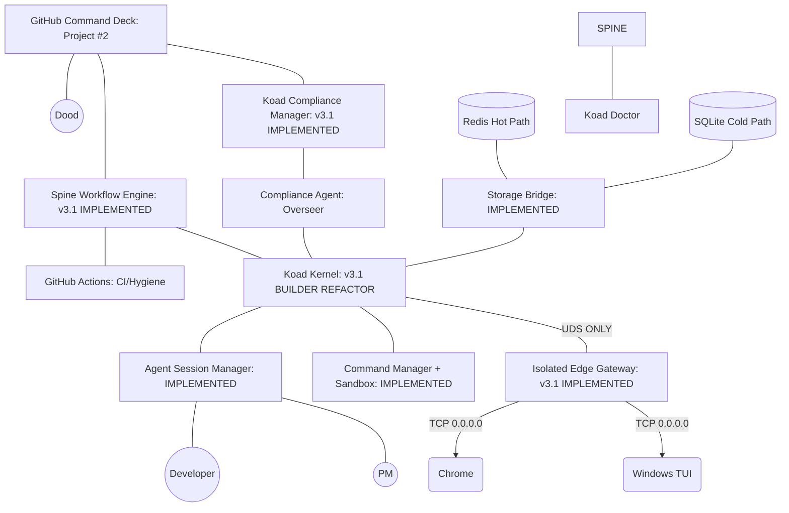

# KoadOS Architecture: The Agentic Operating System

## 1. System Vision
KoadOS is not a static CLI or a standard web application; it is a **Distributed Agentic Operating System**. It is designed to host, orchestrate, and monitor autonomous AI agents (PMs, Developers, Reviewers) while providing the human Admin ("Dood") with absolute monitoring and override capabilities via unified Command Decks.

## 2. Core Architectural Diagram

This chart represents the current target architecture of KoadOS. It is maintained here and must be updated as the system evolves.

## 3. Core Component Definitions

### A. The Spine (Event Bus)
The central nervous system. Rather than direct, blocking RPC calls between agents and managers, KoadOS uses an **Event-Driven Architecture** backed by Redis Streams. Agents publish *Intents*, and Managers consume them asynchronously, allowing massive concurrency without deadlocks.

### B. Storage Bridge
Abstracts the duality of KoadOS state:
- **Hot Path (Redis)**: Live telemetry, active task streaming, volatile context.
- **Cold Path (SQLite)**: Long-term memory, execution history, system configuration.

### C. Agent Session Manager (ASM)
The lifecycle controller for AI agents. It handles agent instantiation, identity verification, and context scoping. It ensures that a PM agent and a Developer agent operating in the same project share a unified view of reality.

### D. Command Manager + Sandbox
The execution engine for the OS. It translates agent Intents into literal shell commands or API calls.
- **Sandbox Policy**: Enforces strict security bounds based on the requesting Agent's role. For example, Developer agents are restricted from modifying KoadOS kernel files or using `sudo`, while the Koad Admin retains root privileges.

### E. Edge Gateway
The consolidated I/O edge of KoadOS. Instead of scattered servers causing port collisions, the Edge Gateway acts as a unified reverse-proxy and protocol upgrade layer (HTTP, WebSocket, gRPC) ensuring clean cross-environment connectivity (e.g., WSL to Windows 11).

## 4. KoadOS Development Canon
The management of KoadOS is strictly governed by the following protocols to ensure system integrity:
- **Ticket-First Workflow**: ALL work begins with a local `Ticket` object (Problem/Solution/Implementation) which mirrors to a GitHub Issue.
- **Anti-Overengineering Protocol (AOP)**: Every ticket MUST undergo a four-pillar evaluation before implementation:
    1. **Relevance Evaluation**: Does this feature align with the "Agentic OS" vision, or is it a legacy human tool?
    2. **Value Validation**: Does the security/utility gain outweigh the friction introduced to development and testing?
    3. **Utility Audit**: Is there a simpler, native way to achieve the goal without adding new dependencies or host-level state?
    4. **YAGNI Review**: "You Aren't Gonna Need It." Eliminate "just-in-case" architecture before the first line of code is written.
- **Tight Git Coupling**: Incremental development is enforced via surgical, issue-linked commits.
- **GitHub Orchestration**: All planning and status tracking is handled via GitHub Projects and Milestones.
- **Automated Compliance**: The `repo-clean` tool enforces zero-drift repository hygiene.
- **Master Manifest**: The `MANIFEST.md` file acts as the authoritative source inventory and role-based ownership map.
- **Deep-Grid Testing Protocol (DTP)**: Every construct component MUST maintain 100% "Test Surface" coverage:
    1. **Full-Spectrum Audit**: No exclusion. Every logic path must have Unit, Integration, and E2E coverage.
    2. **Integration Matrix Review**: Automated verification of cross-system links (e.g., Gateway-to-Spine).
    3. **Surface Audit**: Every exposed port, socket, and API node must have a corresponding "Sentinel" probe test.
    4. **The Sentinel Hook**: The `repo-clean` tool enforces test existence. If a component is in the `MANIFEST.md` without a corresponding test suite, the construct fails the **Condition Green** audit.
- **Self-Documenting Charts**: Architecture maps must be updated in real-time.

## 5. Security & Isolation (Strategic Direction)

KoadOS prioritizes **Agility and Scalability** for AI Micro-Agents. The system operates as a **Consolidated Virtual Construct** at `~/.koad-os/`, utilizing software-defined boundaries to maintain system integrity.

### 🛡 Sandbox Policy (The ICE)
- **Software-Level Isolation**: The `Sandbox` engine acts as the construct's ICE (Intrusion Countermeasures Electronics), enforcing command blacklisting (e.g., preventing unauthorized `sudo` or access to sensitive Admin memory sectors).
- **Process Isolation**: Future micro-agents (Neural Imprints) will utilize lightweight user-space sandboxing (like `bwrap` or WASM) to ensure process integrity within the construct without requiring host-level Unix users.
