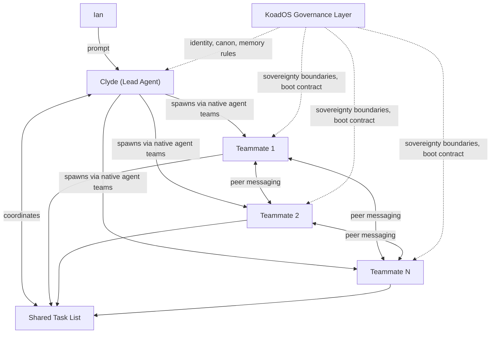

<aside>
🐺

**v2 — Native Agent Teams Reframe** · March 24, 2026 · Authored by Noti for Tyr to map/plan, Clyde to implement.

This revision replaces the custom minion orchestration design with a strategy that adopts Claude Code's native Agent Teams as the execution layer. KoadOS provides the governance, identity, and sovereignty layer on top.

</aside>

---

## 1. Strategic Principle

> Adopt the native engine. Own the flight rules.
> 

Claude Code Agent Teams already provides: teammate spawning, shared task lists, peer-to-peer messaging, lead/teammate hierarchy, and lifecycle management. Building a competing coordination layer is wasted effort that will fall behind Anthropic's iteration pace.

**KoadOS adds what native teams lack:** sovereign identity, canon compliance, memory governance, sovereignty boundaries, token discipline, and crew philosophy. These are orthogonal to the execution layer and compose cleanly on top of it.

---

## 2. Architecture Overview



| **Layer** | **Provided By** | **Responsibilities** |
| --- | --- | --- |
| Execution | Claude Code Agent Teams (native) | Spawn teammates, shared task list, peer messaging, lifecycle, session management, file access |
| Governance | KoadOS | Sovereign identity, canon compliance, memory access rules, sovereignty boundaries, token discipline, naming conventions, escalation protocol |

---

## 3. Role Definitions

### Clyde — Lead Agent (Sovereign KAI)

- **What stays the same:** Persistent sovereign identity. Full KoadOS onboarding, canon compliance, memory read/write, growth tracking. The only Claude agent at this tier.
- **What changes:** Clyde operates as the **native agent teams lead**. Instead of custom orchestration, Clyde uses the built-in team coordination tools: creating teammates, assigning tasks via the shared task list, sending messages, and synthesizing results.
- **System prompt:** Clyde's `.claude/agents/KAPVs/clyde.md` definition includes KoadOS identity, canon references, sovereignty rules, and the team lead behavioral contract. This is the KoadOS layer that native teams doesn't provide.

### Teammates (formerly "Minions")

- **What stays the same:** Lightweight, ephemeral, task-scoped. No sovereign status, no unique identity, no growth tracking. They inherit baseline instructions and operate under Clyde's authority.
- **What changes:** Teammates are native agent team members, not a custom abstraction. Their boot contract is delivered via the teammate's system prompt (set by the lead when spawning). They use the native shared task list to claim work and the native messaging system to communicate.
- **Naming convention (KoadOS overlay):** Teammates use sequential IDs under Clyde's namespace: `clyde-1A`, `clyde-1B`, etc. This is a KoadOS convention layered on top of native teammate IDs for human readability and log tracing.

---

## 4. What Native Agent Teams Provides (Do Not Rebuild)

These capabilities are handled by the native layer. KoadOS should **not** reimplement them:

- [ ]  **Teammate spawning and lifecycle** — lead creates teammates, teammates self-terminate or are cleaned up by lead.
- [ ]  **Shared task list** — teammates claim tasks, update status, lead monitors progress.
- [ ]  **Peer-to-peer messaging** — teammates communicate directly without routing through the lead.
- [ ]  **Session isolation** — each teammate has its own context window.
- [ ]  **Display modes** — tmux split-pane for per-teammate visibility; `Shift+Down` to cycle.
- [ ]  **Ian can message teammates directly** — without going through Clyde.

---

## 5. What KoadOS Adds On Top (Implement These)

### 5.1 Teammate Boot Contract

The minimal instruction set every teammate receives when spawned by Clyde. Delivered as the teammate's system prompt via the native spawn mechanism.

**Must include:**

- KoadOS identity: "You are a teammate operating under Clyde's authority within the KoadOS system."
- Core references: Read-only access to `CLAUDE.md` and relevant canon snippets.
- Sovereignty boundary (see 5.3).
- Token discipline rules (see 5.4).
- Naming: Teammate acknowledges its assigned `clyde-\*` ID.
- Report format (see 5.2).

**Must NOT include:**

- Full KoadOS onboarding (that's Clyde-tier only).
- Memory write access.
- Growth journal or maturity tracking.

**Implementation:** Define as a reusable template in `.claude/agents/KAPVs/clyde-teammate.md` with YAML frontmatter. Clyde references this when spawning teammates.

### 5.2 Delegation & Reporting Interface

When Clyde creates a task on the shared task list or spawns a teammate, the task description follows this structure:

- Task Packet Format
    
    **Task ID:** `clyde-\<session\>-\<seq\>` (e.g. `clyde-1A`)
    
    **Objective:** One-sentence description of what "done" looks like.
    
    **Context files:** List of files/paths the teammate should read.
    
    **Scope ceiling:** S / M / L (see 5.4 for definitions).
    
    **Output format:** What the teammate produces (e.g. "PR-ready diff", "analysis in [FINDINGS.md](http://FINDINGS.md)", "test results in stdout").
    
    **Guardrails:** Any task-specific constraints (e.g. "do not modify files outside `/src/parser/`").
    

When a teammate completes work, it reports back via the native messaging system using this format:

- Report-Back Format
    
    **Task ID:** `clyde-1A`
    
    **Status:** Done | Blocked | Escalating
    
    **Artifacts:** List of files created/modified.
    
    **Escalations:** Any sovereignty boundary hits or scope ceiling breaches.
    
    **Notes:** Brief context for the lead.
    

### 5.3 Sovereignty Boundary

Teammates **cannot** do the following without escalating to Clyde (or to Ian if Clyde is offline):

- Write to canon, memory, or KoadOS core state.
- Communicate with agents outside the current team (cross-agent comms).
- Modify `.claude/agents/` definitions or KoadOS config files.
- Promote themselves to persistent status.
- Exceed their assigned scope ceiling.

**"Clyde offline" detection:** If a teammate sends a message to the lead and receives no response within 2 task-list cycles, the teammate should post its escalation to a `ESCALATIONS.md` file in the project root and halt the blocked subtask. Ian reviews async.

### 5.4 Token Discipline & Scope Ceilings

Every teammate task is assigned a scope ceiling. Clyde is responsible for setting these and monitoring aggregate burn.

| **Tier** | **Guideline** | **Examples** |
| --- | --- | --- |
| **S** (Small) | Single-file change, quick lookup, focused test. Teammate should finish in one pass with minimal context loading. | Fix a typo, run a test suite, look up a config value |
| **M** (Medium) | Multi-file change or moderate analysis. May require reading several files but scope is well-defined. | Implement a single feature, refactor a module, write a design analysis |
| **L** (Large) | Cross-cutting change or deep investigation. Clyde should consider splitting into multiple M tasks instead. | Architecture spike, multi-module refactor, full audit |

**Rules:**

- Teammates favor concise output and avoid unnecessary context loading.
- If a teammate suspects it's exceeding its ceiling, it reports to Clyde immediately rather than continuing.
- Clyde flags to Ian when aggregate team burn looks disproportionate to task value.

### 5.5 Environment-Agnostic Execution

Clyde and all teammates must operate from any Claude Code session type:

- Claude Code CLI (bash terminal)
- Claude Code in VS Code
- Cloud sessions (API / headless)

The boot contract and governance layer must not assume any specific client. Environment-specific capabilities (tmux split-panes, VS Code workspace context, etc.) are leveraged when available but never required.

**Environment detection:** The teammate boot contract includes a lightweight probe: check for tmux, check for VS Code workspace, check for available MCP tools. Results are logged but do not gate execution.

### 5.6 Teammate Tracking

Clyde maintains awareness of active teammates via the **native shared task list** (no separate registry needed). The task list already tracks who is working on what.

For post-session review, Clyde writes a brief **team summary** to `TEAM-LOG.md` in the project root:

- Session date
- Teammates spawned (IDs)
- Tasks completed / failed / escalated
- Estimated token burn (qualitative: low / moderate / high)
- Lessons learned (optional)

---

## 6. File Structure

```
.claude/
  agents/
    clyde.md                  # Clyde's lead agent definition (KoadOS identity + team lead contract)
    clyde-teammate.md         # Reusable teammate boot contract template
  settings.json               # CLAUDE_CODE_EXPERIMENTAL_AGENT_TEAMS: "1"

project-root/
  ESCALATIONS.md              # Teammate sovereignty escalations (async review by Ian)
  TEAM-LOG.md                 # Post-session team summaries by Clyde
```

---

## 7. Migration From v1

| **v1 Concept** | **v2 Replacement** | **Action** |
| --- | --- | --- |
| Custom minion spawn/lifecycle | Native agent teams spawn | Remove custom orchestration code. Use native team tools. |
| Custom `.md` coordination file | Native shared task list | Retire `agent-memory-protocol` pattern for team coordination. Keep for other uses. |
| Custom delegation YAML packet | Task Packet Format (5.2) via natural language | Clyde describes tasks in the format above when adding to the shared task list. |
| Minion boot contract (custom) | `clyde-teammate.md` agent definition | Author the `.claude/agents/KAPVs/clyde-teammate.md` file per spec in 5.1. |
| Ian-dispatched vs Clyde-dispatched minions | Both use the same native mechanism | Ian can start teammates directly or tell Clyde to spawn them. Same contract either way. |
| Minion naming (`clyde1A`) | Teammate naming (`clyde-1A`) | Cosmetic. Hyphenated format for readability. |

---

## 8. Implementation Checklist for Clyde

These are the concrete deliverables Tyr should map and assign:

- [ ]  **Author `clyde.md`** — Lead agent definition with KoadOS identity, canon references, team lead behavioral contract, and sovereignty rules.
- [ ]  **Author `clyde-teammate.md`** — Reusable teammate boot contract per spec in 5.1.
- [ ]  **Enable agent teams** — Add `CLAUDE_CODE_EXPERIMENTAL_AGENT_TEAMS: "1"` to `.claude/settings.json`.
- [ ]  **Create `ESCALATIONS.md` template** — Empty file with header explaining the escalation protocol.
- [ ]  **Create `TEAM-LOG.md` template** — Empty file with header explaining the logging format.
- [ ]  **Test: Clyde spawns a 2-teammate team** — Smoke test with a simple parallel task (e.g. one teammate reads and summarizes a file, another writes a test). Validate task list, messaging, and report-back format.
- [ ]  **Test: Ian directly messages a teammate** — Validate that Ian can interact with teammates without going through Clyde.
- [ ]  **Test: Sovereignty boundary** — Have a teammate attempt a canon write and verify it escalates correctly.
- [ ]  **Document lessons learned** — First `TEAM-LOG.md` entry after smoke tests.

---

## 9. Open Questions for Tyr/Ian Review

1. **Git worktrees for file isolation?** Native agent teams can use git worktrees so each teammate works on a separate branch, avoiding file conflicts. Should this be default behavior or opt-in per task?
2. **Recursive teams?** Agent teams supports teammates spawning sub-teammates. Should this be allowed or restricted to Clyde-as-lead only?
3. **Cost monitoring tooling?** Native agent teams doesn't surface token usage per teammate. Should Clyde estimate burn qualitatively, or should we build/find a usage tracker?
4. **Teammate promotion path.** v1 mentioned "no persistence unless explicitly promoted" but never defined the destination. Is this still needed, or does the ephemeral model suffice?
5. **Tyr's role in team coordination.** Once Tyr is online, does Tyr become a potential lead agent for non-Clyde teams? Or does Tyr remain a planner/mapper that delegates to Clyde-led teams?

---

## 10. Reference

- [Claude Code Agent Teams Docs](https://code.claude.com/docs/en/agent-teams)
- [Claude Code Subagents Docs](https://code.claude.com/docs/en/sub-agents)
- [Anthropic: Building a C Compiler with Agent Teams](https://www.anthropic.com/engineering/building-c-compiler)
- [Anthropic: Building Effective Agents](https://www.anthropic.com/research/building-effective-agents)