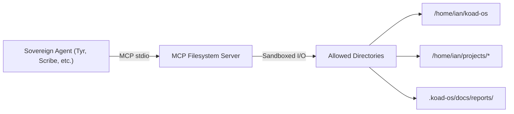

## Purpose
Integrate the official MCP Filesystem Server (@modelcontextprotocol/server-filesystem) as a first-class MCP skill in KoadOS, giving sovereign agents sandboxed read/write access to local project directories — configs, code, logs, manifests, reports, and skill packages.
This skill replaces ad-hoc file manipulation with a standardized, permission-scoped MCP tool surface that aligns with the Citadel security model.
---
## Problem Statement
KoadOS agents frequently need to interact with the local filesystem during development, auditing, and operational workflows:
- Tyr needs to read/write code files, apply diffs, and scaffold new skill directories.
- Scribe needs to scan directory trees, read docs, and produce inventories.
- Vigil (or a future audit agent) needs to traverse project structures for compliance checks.
- Any agent running a skill that produces file-based reports (e.g., github-audit) needs reliable file I/O.
Currently:
- There is no standardized, sandboxed mechanism for agents to perform filesystem operations.
- Agents rely on raw shell commands or ad-hoc Python scripts with no access control.
- No directory-level permission scoping exists — an agent with shell access can touch anything.
- File edit operations lack dry-run/diff preview capabilities.
The MCP Filesystem Server solves all four problems with a battle-tested, open-source implementation.
---
## Source Repository
- Repo: modelcontextprotocol/servers — src/filesystem
- Package: @modelcontextprotocol/server-filesystem
- License: MIT
- Runtime: Node.js (TypeScript)
- Transport: stdio (MCP standard)
- Stars: 81k+ (parent monorepo)
---
## Capability Surface
The MCP Filesystem Server exposes the following tools:
All operations are sandboxed to explicitly whitelisted directories. No operation can escape the allowed path list.
---
## Skill Anatomy
```javascript
.koad-os/skills/<agent>/mcp-filesystem/
├── SKILL.md                      # Skill definition + trigger patterns
├── scripts/
│   ├── start-server.sh           # Launch MCP filesystem server with scoped dirs
│   └── health-check.sh           # Verify server is running and accessible
├── config/
│   └── skill.toml                # Skill config: allowed dirs, server settings
├── references/
│   └── tool-annotations.md       # Read-only vs write tool classification
└── _eval/
    ├── test-prompts.md
    └── grading-schema.md
```
---
## SKILL.md Specification
### Frontmatter
```yaml
name: mcp-filesystem
driver: none                     # No AI inference required — pure MCP tool surface
description: >
  Sandboxed local filesystem access via the official MCP Filesystem Server.
  Provides read, write, edit, search, and directory operations scoped to
  whitelisted project directories. Use when an agent needs to read code,
  write reports, scaffold directories, apply file edits, or search project
  structures.
trigger_patterns:
  - "Read the file *"
  - "Write to *"
  - "Edit the file *"
  - "List the directory *"
  - "Search for * in *"
  - "Show the directory tree"
  - "Create the directory *"
  - "What files are in *"
requires:
  - node >= 18
  - npx
tier: crew                       # Available to all sovereign agents
context_cost: low                # Tool calls return targeted content, not bulk
author: tyr
version: 1.0.0
```
### skill.toml
```toml
[skill]
name = "mcp-filesystem"
version = "1.0.0"
driver_type = "none"             # No AI inference — pure MCP tool

[server]
package = "@modelcontextprotocol/server-filesystem"
transport = "stdio"

# Per-agent directory scoping.
# Each agent gets ONLY the directories relevant to its role.
# Override per agent in agent-specific config.
[server.defaults]
allowed_directories = [
  "/home/ian/koad-os"
]

[server.agent_overrides.tyr]
allowed_directories = [
  "/home/ian/koad-os",
  "/home/ian/projects/agents-os",
  "/home/ian/projects/sws-airtable-api"
]

[server.agent_overrides.scribe]
allowed_directories = [
  "/home/ian/koad-os",
  "/home/ian/koad-os/.koad-os/docs"
]

[server.agent_overrides.vigil]
allowed_directories = [
  "/home/ian/koad-os"              # Read-only audit scope
]
```
---
## Citadel Security Alignment
Key security properties:
- All paths are validated and resolved (including symlink resolution) before any operation.
- Directory traversal attacks are blocked — paths outside the allowed list are rejected.
- Per-agent directory scoping means Scribe can't write to Tyr's workspace and vice versa.
- Write operations are clearly annotated as destructive/idempotent via MCP tool annotations.
- Docker deployment option available for additional sandboxing via bind mounts.
---
## Integration Architecture

The server runs as a sidecar process per agent session, launched via npx or Docker. The agent communicates over stdio using standard MCP client protocol.
---
## Scope Boundaries
---
## Open Questions
---
## Constraints & Rules of Engagement
- Sandboxed by default. No agent may access directories outside its configured allowed list. Period.
- No driver variant needed. This is a pure MCP tool skill — no AI inference layer. The drivers/ directory is not required per the Driver-Variant Skill Pattern.
- Canon compliance. Tyr must open a GitHub Issue in agents-os before writing any code.
- Node.js dependency acknowledged. This is accepted as a pragmatic v1 choice. A native Rust implementation is explicitly deferred to v2+ when Citadel matures.
- Write safety. Destructive tools (write_file, edit_file, move_file) should log all operations to .koad-os/docs/audits/filesystem-ops.log for auditability.
---
## Deliverables (Tyr)
- [ ] Open GitHub Issue in agents-os for this skill (per Canon).
- [ ] Scaffold the mcp-filesystem skill directory under .koad-os/skills/.
- [ ] Write SKILL.md with frontmatter and trigger patterns.
- [ ] Write skill.toml with per-agent directory scoping.
- [ ] Write start-server.sh to launch the MCP server with correct args.
- [ ] Write health-check.sh to verify server availability.
- [ ] Test with at least one sovereign agent (Tyr recommended as first adopter).
- [ ] Document integration in the Skill Writing Guide.
- [ ] Create eval suite in _eval/.
---
## Success Criteria
- A sovereign agent can invoke read_text_file, write_file, edit_file, list_directory, directory_tree, and search_files through standard MCP tool calls.
- All operations are sandboxed to the agent's configured allowed directories.
- Attempting to access a path outside the allowed list returns a clear error — no silent failures.
- edit_file dry-run mode produces accurate git-style diffs before committing changes.
- The skill deploys cleanly via npx with no manual setup beyond config.
- Write operations are logged for auditability.
- The skill passes eval at ≥ 80% on the test scenario suite.
---
> Note to Tyr: This skill has no driver variant requirement — it's pure MCP tooling. Focus on directory scoping config and clean server lifecycle management. The main architectural decision pending is Node.js vs. native Rust — defer to Ian on that call before over-investing in the Node wrapper.
