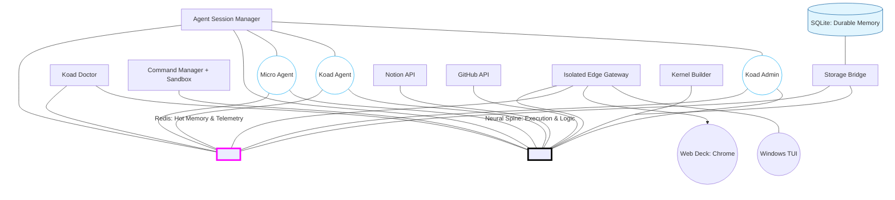

# KoadOS Architecture: The Dual-Bus Perspective (v4.2)

This diagram represents the unified vision of KoadOS as an autonomic organism, utilizing a dual-bus architecture for state (Hot Memory) and execution (Neural Spine).

### **Core Principles of this Model:**
- **Hot Memory (Magenta):** Transient, high-speed state synchronization. Every "Verification" and "Heartbeat" flows through here.
- **Neural Spine (Black):** The deterministic route for Intents, Commands, and Protocol Enforcement.
- **The Sandbox:** Integrated into the Command Manager to ensure every Spine-driven execution is role-verified.
- **The Doctor:** Has a "God-Eye" view across both buses to verify environmental integrity.

---

## Strategic Deep Dive: The CQRS Shift

Analyzing this perspective against our v4.1 codebase reveals a clear roadmap for simplification and evolution toward the v5.0 Swarm. This diagram represents a shift to **Command Query Responsibility Segregation (CQRS)**.

### 1. Data Plane vs. Control Plane
- **The Hot Memory (Redis)** is our Data Plane. It is built for high-frequency *Queries*. Agents should read their context, peer status (the "LinkedIn" profiles), and system telemetry directly from here without ever hitting a gRPC endpoint.
- **The Neural Spine (gRPC)** is our Control Plane. It is built for strict, validated *Commands*. Agents only invoke the Spine when they need to mutate the system (e.g., spawn an issue, write a file, trigger a build).

### 2. Decoupling the "God Object"
Currently, the `koad-spine` binary hosts the ASM, the Doctor, and the Command Sandbox as tightly coupled threads. To match this vision, these should be treated as independent "organs" attached to the buses. If the Doctor crashes, the Spine should remain unaffected. This allows us to write simpler, hyper-focused micro-daemons.

### 3. The "Excavator" Context Model
By standardizing on this Dual-Bus, we solve the Context Debt problem. A **Dynamic Context Orchestrator** can sit on the Hot Memory bus, constantly summarizing logs and hydrating reference files (like `RULES.md`) into specific Agent registers in Redis. When an Agent boots, its environment is already prepared. It doesn't "search" for context; the context is pushed to its Hot Memory slot autonomously.
