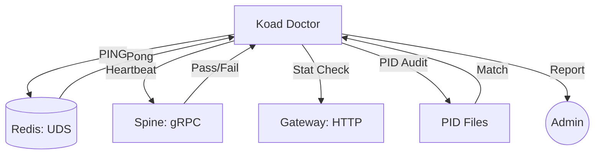

# Component: Koad Doctor (E2E Diagnostics)

## 1. High-Level Summary
- **Component Name:** Koad Doctor
- **Primary Role:** High-level diagnostic tool that verifies the health, integrity, and connectivity of the entire KoadOS ecosystem.
- **Plane:** Control Plane (Resilience)

## 2. Mermaid Visualization

## 3. Interfaces & Contracts
### 3.1. Inputs (Listens To)
- **Environment:** Reads `KOAD_HOME`, `GITHUB_ADMIN_PAT`.
- **File System:** Reads `*.pid` and `*.sock` files.
- **gRPC:** Calls `Heartbeat` and `GetSystemState`.

### 3.2. Outputs (Broadcasts / Returns)
- **CLI:** Prints the "E2E Health Report" (Condition Green/Yellow/Red).
- **Spine:** Can trigger a `PostSystemEvent` to notify the ecosystem of a degraded state.

## 4. State Management
- **Stateless/Stateful:** Stateless (Diagnostic tool).
- **Storage:** N/A

## 5. Failure Modes & Recovery
- **Known Failure States:** If the Doctor itself cannot connect to the Spine, it identifies the Spine as the primary failure point.
- **Recovery Protocol:** N/A (The Doctor *is* the recovery trigger).
