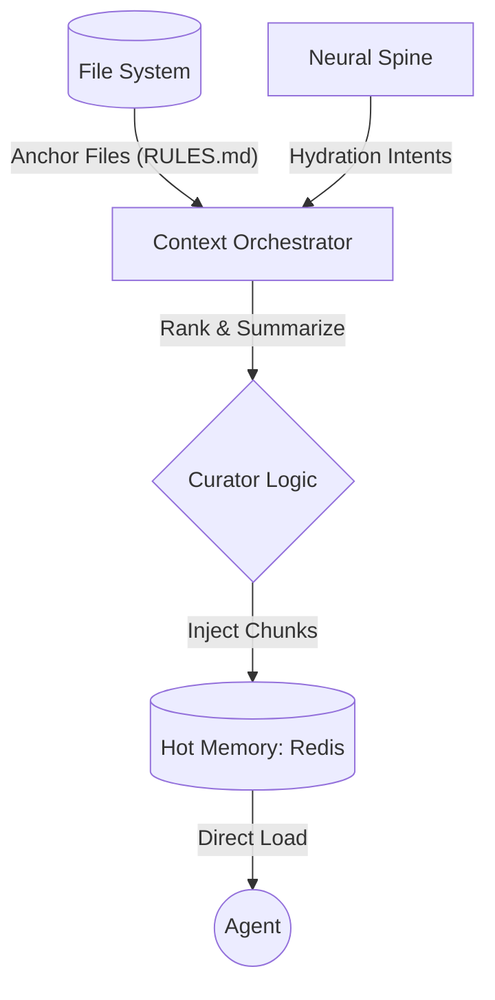

# Component: Dynamic Context Orchestrator

## 1. High-Level Summary
- **Component Name:** Dynamic Context Orchestrator
- **Primary Role:** Background worker that curates and hydrates the Agent's Hot Memory registers to prevent context rot and token bloat.
- **Plane:** Data Plane (Logic)

## 2. Mermaid Visualization

## 3. Interfaces & Contracts
### 3.1. Inputs (Listens To)
- **File System:** Watches for changes in core anchors (`RULES.md`, `SPEC.md`).
- **Redis:** Listens for `koad:context:sync` triggers.
- **Spine gRPC:** Receives `HydrateContext` requests from the Ingestion Pipeline (#86).

### 3.2. Outputs (Broadcasts / Returns)
- **Redis:** Writes to `koad:session:ID:hot_context` Hash.
- **Redis:** Updates `koad:context:size` for the **Context Governor**.

## 4. State Management
- **Stateless/Stateful:** Stateless (Functional logic acting on external state).
- **Storage:** N/A (Operates on Redis).

## 5. Failure Modes & Recovery
- **Known Failure States:** Context bloat (over 50k chars), redundant hydration loops.
- **Recovery Protocol:** **The Governor (#84)** enforces strict caps and deduplication hashing. Manual `koad system context flush` clears the registers.
