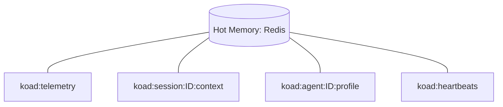

# Component: Hot Memory (Redis)

## 1. High-Level Summary
- **Component Name:** Hot Memory
- **Primary Role:** Provides a high-speed, transient data bus for agent state, context, and telemetry.
- **Plane:** Data Plane (Redis)

## 2. Mermaid Visualization

## 3. Interfaces & Contracts
### 3.1. Inputs (Listens To)
- **Redis Commands:** SET, HSET, PUBLISH, EXPIRE
- **Payload:** Serialized JSON or raw strings

### 3.2. Outputs (Broadcasts / Returns)
- **PubSub:** Broadcasts to all subscribers (Gateway, TUI, Agents)
- **Queries:** Direct HGET/GET for high-frequency reads

## 4. State Management
- **Stateless/Stateful:** Stateful (Transient)
- **Storage:** Redis (In-memory, non-durable by default)

## 5. Failure Modes & Recovery
- **Known Failure States:** Connection Refused, Memory Limit hit.
- **Recovery Protocol:** Spine Autonomic Sentinel triggers hydration from SQLite if Redis state loss is detected.
