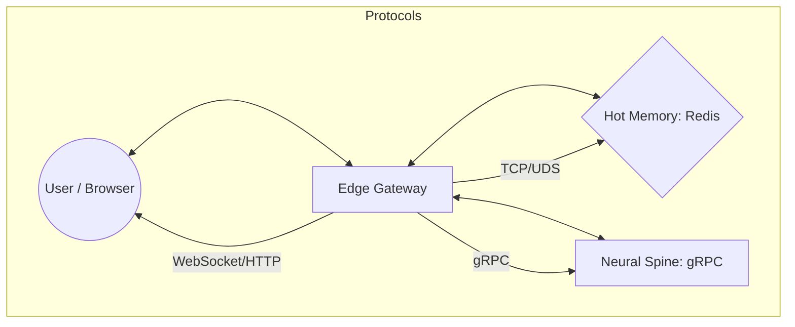

# Component: Isolated Edge Gateway

## 1. High-Level Summary
- **Component Name:** Isolated Edge Gateway
- **Primary Role:** Serves as the high-availability interface between internal KoadOS services and external users (Web Deck, TUI).
- **Plane:** Interface Plane

## 2. Mermaid Visualization

## 3. Interfaces & Contracts
### 3.1. Inputs (Listens To)
- **Redis:** Subscribes to `koad:telemetry` for live UI updates.
- **gRPC:** Fetches system state and task history from the Spine.
- **HTTP/WS:** Inbound requests from the Web Deck.

### 3.2. Outputs (Broadcasts / Returns)
- **WebSockets:** Pushes live events to the Chrome Web Deck.
- **HTTP API:** Serves session data and system config to the UI.

## 4. State Management
- **Stateless/Stateful:** Stateless (The Gateway proxies state from Redis/Spine).
- **Storage:** N/A

## 5. Failure Modes & Recovery
- **Known Failure States:** Port 3000 collision, WebSocket disconnect, Spine timeout.
- **Recovery Protocol:** The **Autonomic Watchdog** (#78) monitors the Gateway PID and Port 3000, triggering an automatic restart if the bridge collapses.
