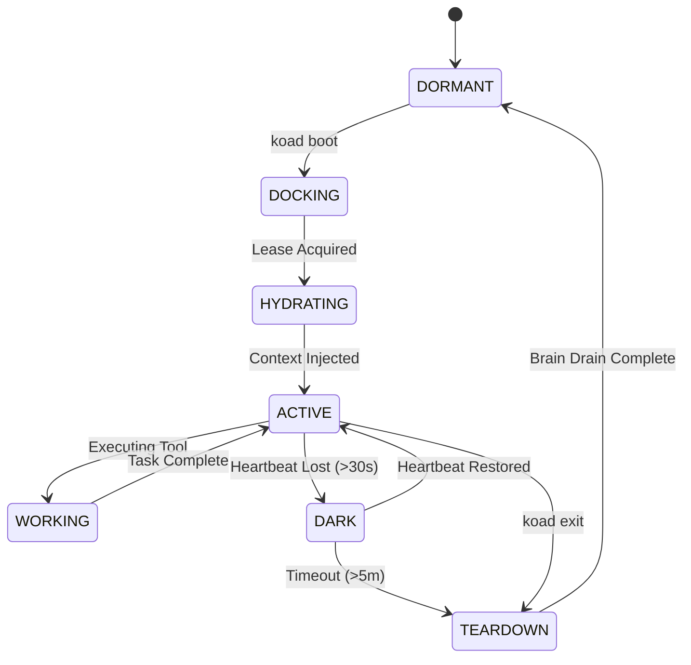

# v5.0 Agent Chassis — The Docking Protocol

> [!IMPORTANT]
> **Core Role:** The Agent Chassis is the standardized physical interface between an AI model and the KoadOS Station. It manages identity, memory hydration, and the formal session lifecycle.

---

## 1. The Docking State Machine
We eliminate "Identity Lock" loops by moving to a formal, Redis-managed state machine.

## 2. The Context Package (Hydration)
Before an agent is considered `ACTIVE`, the Chassis must assemble a high-fidelity **Context Package**.

| Component | Source | Purpose |
| :--- | :--- | :--- |
| **Identity** | SQLite (`identities`) | Defines Rank, Personality, and Role. |
| **Memories** | SQLite (`knowledge`) | Relevant facts/learnings filtered by project. |
| **Awareness** | Redis (`streams`) | Recent station events and peer activity. |
| **Tools** | Driver Config | Standardized API and CLI tool definitions. |

## 3. The "Brain Drain" Protocol
To ensure zero data loss, an agent cannot release its identity lease until the **Brain Drain** is verified.
1. **Introspection:** Agent generates a summary of learnings.
2. **Commit:** Learning is sent to the Spine via gRPC.
3. **Verification:** Spine confirms write to the `knowledge` table.
4. **Eject:** Chassis releases the Redis lease and deletes the session hash.

## 4. Universal Dock Adapters
The Chassis is model-agnostic. Specific adapters translate the **Hydrated Context** into model-native formats:
- **Gemini Adapter:** Maps to `system_instruction` + `tools`.
- **Claude Adapter:** Maps to `CLAUDE.md` + MCP servers.
- **Ollama Adapter:** Maps to minimal system prompts for local micro-agents.

---
*Next: [The Workspace Manager — Git Isolation](WORKSPACE_MANAGER.md)*
