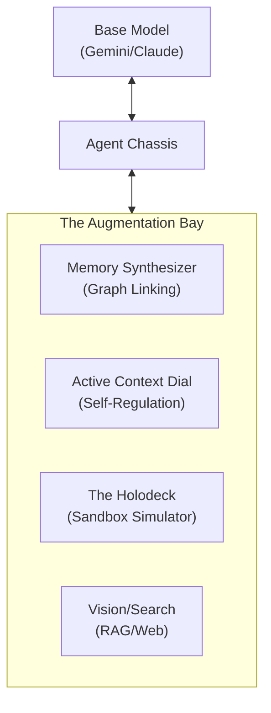

# v5.0 Cognitive Augmentation (The "Super Saiyan" Protocol)

> [!IMPORTANT]
> **Primary Mandate:** The model is the base form. KoadOS is the multiplier.
> The Citadel must provide active, background systems that exponentially increase an agent's memory retention, context control, and decision-making accuracy. 

---

## 1. The Augmentation Bay (Modular Power-Ups)
The Agent Chassis doesn't just inject static text; it connects the agent to active **Cognitive Systems**. The architecture is designed so that new "power-ups" can be plugged into the Bay at any time without altering the base model.

## 2. Active Context Control (The Dial)
Agents shouldn't be passive receivers of context; they must be active managers of their own minds.

- **The Problem:** The Context Governor (Spine) tries to guess what the agent needs, but sometimes the agent knows better.
- **The Power-Up:** We provide agents with "Context Manipulation Tools."
    - `context_drop(target)`: Agent tells the Spine, "I no longer need the auth module in my hot memory, drop it to save tokens."
    - `context_pin(target)`: Agent tells the Spine, "Keep this error log pinned to the top of my mind, do not evict it."
- **The Result:** The agent dynamically tunes its own token budget and focus area, achieving maximum "Signal-to-Noise" ratio.

## 3. The Memory Synthesizer (Background RAG)
Raw facts in SQLite are good, but synthesized knowledge is better.
- **The Problem:** A database of 1,000 isolated facts is hard to query effectively.
- **The Power-Up:** An Ollama micro-agent runs continuously in the background, analyzing the `knowledge` table. It builds connections. If Tyr learned about a Redis bug on Tuesday, and Sky learned about a UDS socket bug on Thursday, the Synthesizer links them under a "Spine IPC Resilience" tag.
- **The Result:** When Tyr asks a question, he doesn't get a single row back; he gets a synthesized summary of the entire crew's historical experience with that specific domain.

## 4. Decision Support: The Holodeck (Simulation Engine)
Before an agent commits to a destructive or complex action, it needs a safe space to test its hypothesis.
- **The Problem:** Agents guess if a command will work, run it, and spend 5 turns fixing errors if it fails.
- **The Power-Up:** `simulate_action(command)`
    - The WSM (Workspace Manager) creates an ephemeral, ultra-fast snapshot of the current worktree (using hardlinks or memory-fs).
    - The command is executed.
    - The Spine returns the *projected* output and diff.
    - The snapshot is instantly destroyed.
- **The Result:** The agent gains "Future Sight." It can test 3 different refactoring approaches in the Holodeck, evaluate the outcomes, and only apply the winning strategy to the real workspace.

## 5. The Expansion Contract
To add a new system to the Augmentation Bay:
1. Define the capability (e.g., "Vector Search").
2. Build the Micro-Service (a Rust task or Python daemon).
3. Expose it to the `AgentChassis` via a standardized gRPC `Capability` endpoint.
4. The Chassis automatically injects the new capability into the model's tool definitions at boot.

---
*Commanded by Captain Tyr, Designed for Maximum Multiplier.*
