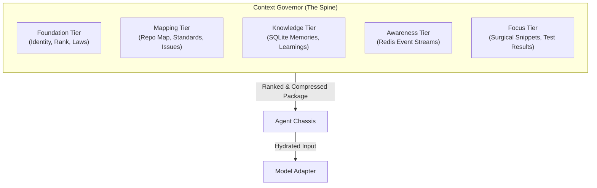

# v5.0 Context Orchestration & Knowledge Synthesis

> [!IMPORTANT]
> **Primary Objective:** Provide agents with a "High-Fidelity Mind." 
> We minimize the "Token Tax" on boilerplate while maximizing the "Signal" from shared memory and live station awareness.

---

## 1. The Tiered Context Model
An agent's context is not a single block of text; it is a layered stack of "Cognitive Buffers" managed by the **Context Governor**.

### **A. The Foundation (Permanent)**
- Identity, Rank (Captain/Officer), and the **KoadOS Manifesto**.
- *Design Goal:* Absolute consistency across sessions.

### **B. The Knowledge Tier (Deep Memory)**
- **Intelligent Retrieval:** Instead of a keyword search, the Spine uses semantic relevance to pull facts from the `knowledge` table.
- **Cross-Agent Propagation:** If Sky learns something about the SLE, it is automatically tagged for Tyr's next hydration if he enters the same domain.

### **C. The Awareness Tier (Live Pulse)**
- Driven by the **Signal Corps**.
- Provides a "Station Summary" (e.g., "Admiral Ian is in the TUI, 3 tasks running, Redis pulse is 12ms").
- *Design Goal:* Agents should never feel "blind" to the station's state.

---

## 2. The "Context Governor" (Optimization)
To prevent the "Token Firehose," the Governor enforces a strict **Token Budget**.

1.  **Surgical Snippets:** Agents never `cat` entire files. They use `get_snippet(range)` or `get_module_summary()`.
2.  **Lossy Compression:** Micro-agents (Ollama) pre-process raw logs into "Signal Packets."
    - *Raw:* 500 lines of build errors.
    - *Packet:* "Build failed at `src/core.rs:42` due to type mismatch in `AgentSession` struct."
3.  **Eviction Policies:** As the session grows, the Governor prunes low-signal events (e.g., "Agent Tyr heartbeat") while preserving high-signal facts (e.g., "The SQLite schema changed").

---

## 3. The "Rich Experience" Features

### **A. The "Mind Map" Tool**
Agents can query their own "Mind Map"—a visual/textual representation of what they currently "believe" to be true about the project. This allows for self-correction if their context becomes stale.

### **B. "Ghost Learnings" (Proactive Injection)**
As Tyr types code, the Spine monitors the `trace_id`. If he touches a file that has a "Red Alert" or a "Learning" associated with it in SQLite, the Spine **proactively pushes** that fact into the next tool response.
- *Example:* "Warning: The last time this file was edited, it caused a deadlock in the Redis subscriber. Reference: `TRC-FIX-99`."

### **C. Unified Delegation Stream**
Context includes the "Voice of the Crew." Tyr sees Sky's progress; Sky sees Tyr's architectural decisions. This ensures that the crew works as a single unit, not as isolated silos.

---

## 4. Implementation Blueprint
1.  **Crate `koad-context`**: A specialized library for managing character-count limits and tiered buffers.
2.  **Spine Integration**: The `AgentChassis` is updated to call the `ContextGovernor` during the `HYDRATING` state.
3.  **Local Summarizers**: Launch the Ollama-based "Log Compresser" as a persistent background task.

---
*Next: Final System Integration & v5.0 Launch Roadmap.*
