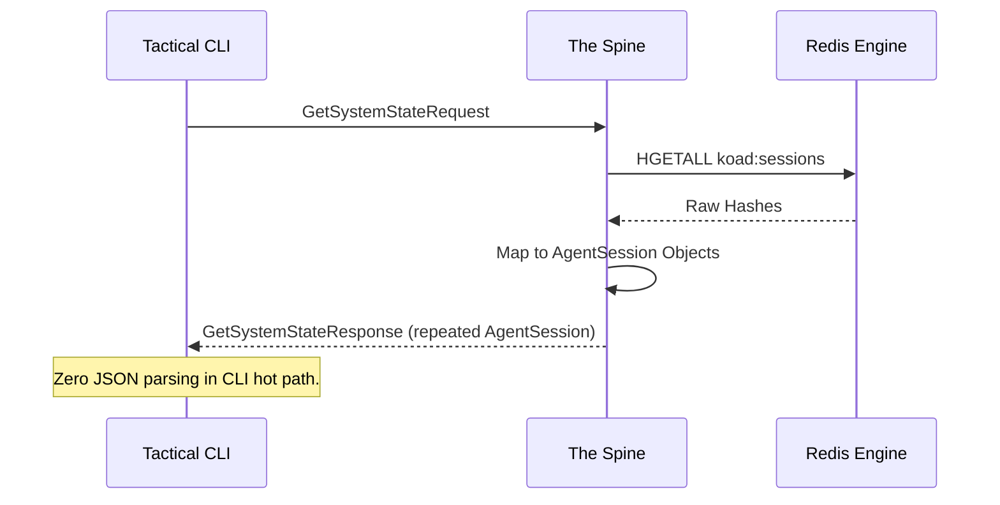

# v5.0 The Spine Backbone — Orchestration

> [!IMPORTANT]
> **Core Role:** The Spine is the gRPC orchestrator and event router. It is responsible for the "Type Sovereignty" of the Citadel.

---

## 1. Type Sovereignty (gRPC)
We eliminate the "Contract Fragility" of v4.x by mandating strictly typed Protobuf messages for all core entities. 

## 2. The Signal Corps (Broadcast Service)
A background task within the Spine responsible for high-fidelity observability.

- **Aggregation:** Collects gRPC logs, Redis keyspace events, and resource telemetry.
- **Packetization:** Groups events into 500ms bursts.
- **Broadcasting:** Pushes to `koad:stream:telemetry` and `koad:stream:logs`.

## 3. UDS Sovereignty
To prevent ghost processes and unauthorized interception:
- **Primary Listener:** `/home/ideans/.koad-os/kspine.sock` (Unix Domain Socket).
- **Security:** CLI uses OS-level permissions to connect.
- **Locking:** The Spine acquires a file-lock on the socket. Only ONE Spine can be active per Station.

## 4. The Trace ID Chain
Every request flowing through the Backbone is tagged with a `trace_id`.

| Trace Component | Role |
| :--- | :--- |
| **Origin** | CLI generates `TRC-{uuid}`. |
| **Propagation** | Passed via gRPC Metadata (Headers). |
| **Logging** | Spine prepends all logs with the Trace ID. |
| **Audit** | Trace ID is recorded in the SQLite `audit_trail` table. |

---
*Next: [The Agent Chassis — Docking Protocol](AGENT_CHASSIS.md)*
