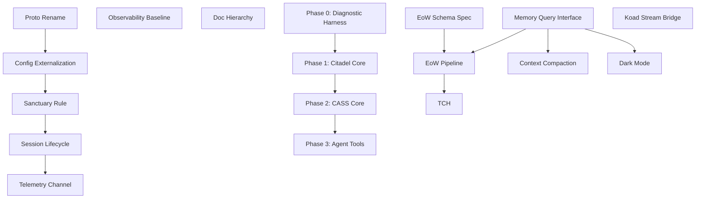

<aside>
🏰

**Purpose:** Define the exact sequence of Citadel systems that must be built and stabilized *before* agent tools and CASS support systems can be properly integrated. This is the builder's execution order — no discovery required.

Prepared by Noti · March 2026

</aside>

---

## Guiding Principle

<aside>
⚡

**Build the floor before the furniture.** Every agent tool in the [Agent Toolset Inventory & Gap Analysis — Citadel Prep](https://www.notion.so/Agent-Toolset-Inventory-Gap-Analysis-Citadel-Prep-b08ab44ce2a6423aae8e2b2443eb6264?pvs=21) depends on one or more Citadel foundation layers. This roadmap defines those layers, their internal dependencies, and the minimal viable state that unlocks each tool phase.

</aside>

---

## Architecture Overview — What "Citadel" Actually Means

The Citadel is not one system. It's three cooperating layers built from scratch — no legacy Spine code is carried forward:

| **Layer** | **Name** | **Responsibility** | **Analogy** |
| --- | --- | --- | --- |
| 1 | **Citadel Core (Control Plane)** | gRPC kernel, session management, identity resolution, command authorization, RPC dispatch | The operating system kernel |
| 2 | **CASS (Citadel Agent Support System)** | Memory hydration, context management, EndOfWatch, inter-agent communication, cognitive tools | The standard library + runtime services |
| 3 | **Agent Tools Layer** | MCP integrations, code knowledge graph, workspace manager, sandbox, dynamic tool loading | The application layer / userland tools |

**Critical insight:** These layers have a strict dependency order. Layer 2 cannot function without Layer 1. Layer 3 cannot function without Layer 2. Attempting to build tools (Layer 3) before CASS (Layer 2) is stable will produce fragile, unintegrated systems.

---

# Phase 0 — Diagnostic Harness & Pre-Citadel Wins

<aside>
🟢

**Timeline:** Can start immediately. No Citadel dependency.

**Goal:** Reduce token burn by 30-40% while Citadel is being built. Establish observability so refactoring has a feedback loop.

</aside>

### 0.1 Observability Baseline

**What:** Instrument the existing Spine with basic telemetry so you can *measure* the impact of every subsequent change.

- Token usage per session (input/output/thinking)
- Session duration and turn count
- Tool call frequency and context size per turn
- File read count per session (codebase exploration metric)

**Why first:** You cannot optimize what you cannot observe. Tyr's strategic review recommended "Phase 0 (Diagnostic Harness) immediately" for exactly this reason.

**Deliverable:** A lightweight telemetry emitter (can be as simple as structured log lines or Redis channel events) that records session metrics.

---

### 0.2 Structured Documentation Hierarchy

**What:** Generate 3-layer navigation indices for all KoadOS repos:

1. Root index → maps domains/tasks to directories
2. Domain directories → maps features to reference files
3. Right-sized reference docs at leaf level

**Why now:** This is a *file-based* intervention. Zero code dependency. Immediately cuts agent codebase exploration from 20+ file reads to 1–3. Research shows this alone drops orientation tokens by 30–40%.

**Deliverable:** `AGENTS.md` / `CLAUDE.md` index files in each repo with architecture cheat sheets.

---

### 0.3 EndOfWatch Schema Specification

**What:** Define the structured format for session handoff documents:

- TOML/JSON frontmatter (agent, session ID, timestamp, task ID, status)
- Markdown body (what was done, what's pending, blockers, decisions made)
- Strict schema so CASS can parse these later

**Why now:** Agents can start writing manual EoW docs immediately. When CASS comes online, it auto-parses the existing archive. No wasted early work.

**Deliverable:** EoW format spec + template. Agents begin writing handoffs in this format immediately.

---

### Phase 0 Unlocks

- ✅ P0 tools from the Toolset Inventory (Doc Hierarchy Generator, EoW Writer)
- ✅ Measurement baseline for all future optimizations
- ✅ Session continuity improvement (manual but structured)

---

# Phase 1 — Citadel Core (Control Plane)

<aside>
🔵

**Timeline:** 2–4 weeks after Phase 0.

**Goal:** Replace the Spine with a stable, configurable Citadel kernel that can host agent sessions reliably. This is the floor.

</aside>

### 1.1 Citadel gRPC Service Definition

**What:** Design and implement `citadel.proto` from scratch — defining the RPC contract for session management, identity resolution, command dispatch, and telemetry. Use the Vigil audit findings and Spine prototype learnings as *design requirements*, not as source code.

**Why first:** Every subsequent system builds on top of these service definitions. The proto is the API contract. Get it right once — with lessons learned baked in, not patched on.

**Deliverable:** `proto/citadel.proto` with all RPC definitions. `koad-citadel` crate compiles and serves a clean implementation with no legacy Spine code.

---

### 1.2 Configuration-First Architecture

**What:** Design the Citadel with externalized configuration from the ground up. The Vigil audit cataloged every hardcoded value in the Spine — use that as a checklist of what *must* be configurable:

- Network addresses/ports → `kernel.toml [network]`
- Sandbox blacklists, protected paths, production triggers → `kernel.toml [sandbox]`
- Drain interval → `kernel.toml [storage]`
- Sovereign identity checks → derive from `identity.rank`, not name strings

**Why now:** Hardcoded values were the #1 source of fragility in the Spine. Building config-first means every subsequent system (model router, sandbox, CASS integration) inherits clean parameterization automatically.

**Deliverable:** Zero hardcoded values in Citadel source. All configuration flows through the TOML hierarchy with `KOAD_` env var overrides.

---

### 1.3 Identity-Based Authorization (Sanctuary Rule)

**What:** Build authorization into the Citadel gRPC layer from day one — not as a bolt-on:

- Tier 1 agents get scoped write access (not unlimited) to sovereign keys
- All identity/role resolution derives from `rank` + `tier` in TOML, never from name strings
- No credential bypass paths (the Vigil audit found `GITHUB_ADMIN_PAT` bypassing sandbox auth in the Spine — this class of issue is eliminated by design)

**Why now:** This is the trust foundation. CASS will manage agent memories and context — if any agent can overwrite sovereign data, the entire memory system is compromised.

**Deliverable:** Identity-aware authorization middleware in the gRPC service. All privilege checks derive from `Identity` struct fields.

---

### 1.4 Stable Session Lifecycle

**What:** Ensure the full boot → heartbeat → dark → drain → purge lifecycle works reliably with configurable timeouts:

- Per-identity `session_policy` overrides (already designed, needs hardening)
- Drain-on-demand RPC (for graceful shutdown / EoW trigger)
- Clean session teardown that preserves cognitive context

**Why now:** CASS's Temporal Context Hydrator (Phase 2) depends on reliable session lifecycle events. If sessions die silently or drain inconsistently, hydration on reboot fails.

**Deliverable:** Reliable session lifecycle with configurable policies. Citadel session manager correctly handles all timeout states. Drain-on-demand RPC available.

---

### 1.5 Telemetry Channel

**What:** Structured telemetry emission from Citadel Core:

- Session events (boot, heartbeat, dark, drain, purge)
- RPC call metrics (latency, success/failure)
- Redis channel (`REDIS_CHANNEL_TELEMETRY`) for real-time monitoring
- SQLite persistence for historical analysis

**Why now:** The Watchdog, CASS, and future Anti-Pattern Detector all consume telemetry. Building the emission layer now means every subsequent system has observability from day one.

**Deliverable:** Telemetry emitter integrated into Citadel Core. Watchdog consumes it for health checks.

---

### Phase 1 Unlocks

- ✅ Stable gRPC API contract for all CASS and tool integrations
- ✅ Configurable system (no more hardcoded constants)
- ✅ Trust boundary enforcement (prerequisite for CASS memory management)
- ✅ Reliable session lifecycle (prerequisite for context hydration)
- ✅ P1 tools: Model Router can be built on top of the gRPC dispatcher
- ✅ P1 tools: Prompt Cache Orchestrator can layer into the gRPC request pipeline
- ✅ P1 tools: KSRP Automation Harness can integrate with the CLI/session system

---

# Phase 2 — CASS Core (Agent Support System)

<aside>
🟣

**Timeline:** 3–6 weeks after Phase 1 stabilizes.

**Goal:** Stand up the cognitive support infrastructure that makes agents *smarter over time* — memory, context management, inter-agent communication.

</aside>

### 2.1 Memory Query Interface

**What:** Build a structured query layer for FactCard memory banks from scratch:

- Query by agent, domain, recency, relevance
- Expose as a CASS RPC service (not raw Redis key access)
- Support both exact lookup and fuzzy/semantic search (Qdrant layer)

**Why first in CASS:** Every other CASS system (TCH, EoW, compaction) needs to *read from and write to* memory. The query interface is the shared data access layer.

**Depends on:** Phase 1 (stable gRPC, identity authorization)

**Deliverable:** `CassMemoryService` gRPC with query, write, and search RPCs. FactCards accessible via structured queries.

---

### 2.2 EndOfWatch Pipeline

**What:** Automate the EoW lifecycle:

1. On session close (or drain-on-demand), CASS generates a structured EoW summary
2. Flash-Lite model extracts key decisions, state changes, and pending items from session context
3. EoW written to Memory Bank in the schema defined in Phase 0.3
4. Indexed for TCH retrieval

**Why now:** Session continuity is the second-highest token drain. Every session that starts from scratch re-burns 10–50k tokens on re-discovery. Automated EoW + TCH breaks this cycle.

**Depends on:** Phase 1.4 (drain-on-demand RPC), Phase 2.1 (memory write interface)

**Deliverable:** Automatic EoW generation on session close. Stored in Memory Bank with structured frontmatter.

---

### 2.3 Temporal Context Hydrator (TCH)

**What:** On agent boot, TCH selectively loads:

- Most recent EoW summary for this agent
- Active task context (linked GitHub issue, pending work)
- Relevant FactCards (filtered by domain/recency, not *all* memories)
- Current Koad Stream entries addressed to this agent

**Why now:** TCH is the complement to EoW. Together they create the *session continuity loop* — the single highest-impact cognitive offload in the entire system.

**Depends on:** Phase 2.1 (memory query interface), Phase 2.2 (EoW pipeline)

**Deliverable:** On `koad boot --agent <name>`, the agent's context window is pre-loaded with surgical, relevant context. No fishing expeditions.

---

### 2.4 Context Compaction Service

**What:** Periodically compress long-running conversation history:

- Summarize old turns into dense state objects
- Replace raw history in Redis hot path with compressed summaries
- Trigger on turn count threshold or context size threshold
- Integrate with StorageBridge drain loop

**Why now:** After TCH handles *boot-time* context, compaction handles *runtime* context growth. Together they bound context size from both ends.

**Depends on:** Phase 1 (StorageBridge, configurable drain), Phase 2.1 (memory write interface)

**Deliverable:** Automatic context compaction integrated into the StorageBridge drain loop. Context growth is bounded.

---

### 2.5 Koad Stream Agent Bridge

**What:** Native programmatic read/write to the Koad Stream Notion database:

- Agent queries unread entries addressed to them on boot (via TCH)
- Agent writes entries directly (decisions, questions, status updates)
- Status lifecycle management (Unread → Acknowledged → Archived)
- Built as a native CASS service using the Notion API

**Why now:** Until this exists, Ian is the manual relay between agents. This is the communication bottleneck that prevents true multi-agent coordination.

**Depends on:** Phase 1 (gRPC layer)

**Deliverable:** Agents can read and write Koad Stream entries without human relay.

---

### 2.6 Dark Mode Persistence Format

**What:** Design and implement the standardized format for agent state when Citadel connectivity is lost:

- Structured `.md` or `.json` files with enforced schema
- Written to local filesystem under `$KOAD_HOME/dark/`
- CASS can parse and reconcile dark-mode artifacts during "Brain Drain" on reconnection

**Why now:** Tyr's review flagged this as 🔴 Unresolved. Without it, "Citadel Independence" is theoretical. Agents that lose connectivity lose all unsaved cognitive state.

**Depends on:** Phase 2.1 (memory interface schema), Phase 2.2 (EoW schema)

**Deliverable:** Dark mode write path + reconciliation protocol. Agents gracefully degrade when Citadel is unavailable.

---

### Phase 2 Unlocks

- ✅ Session continuity loop (EoW → TCH) — eliminates re-discovery waste
- ✅ Bounded context growth — compaction prevents linear cost increase
- ✅ Agent-to-agent communication without human relay
- ✅ Citadel independence for agents (dark mode)
- ✅ P2 tools: Semantic Cache Layer (Qdrant is now integrated via memory query)
- ✅ P2 tools: Canon Enforcer (can validate against structured task/session state)
- ✅ P2 tools: Context Compaction (now integrated into StorageBridge)

---

# Phase 3 — Agent Tools Layer

<aside>
🟠

**Timeline:** Ongoing after Phase 2 stabilizes.

**Goal:** Build the advanced tools that push toward the 80–95% total token reduction target.

</aside>

Phase 3 tools are detailed in the [Agent Toolset Inventory & Gap Analysis — Citadel Prep](https://www.notion.so/Agent-Toolset-Inventory-Gap-Analysis-Citadel-Prep-b08ab44ce2a6423aae8e2b2443eb6264?pvs=21). With Phases 1–2 stable, the following can be built in parallel:

### 3.1 Code Knowledge Graph (`koad-codegraph`)

- Tree-sitter AST parsing → SQLite graph
- Agent queries graph instead of reading files
- 65–97% reduction in codebase exploration tokens
- **Depends on:** Stable CASS for graph storage/retrieval

### 3.2 Dynamic Tool Loader

- Task classification → selective MCP tool definition loading
- 50–70% reduction in per-turn tool overhead
- **Depends on:** Citadel MCP integration layer, Model Router

### 3.3 MCP Code Execution Sandbox

- Agent writes processing code; only results enter context
- Massive token savings on data-heavy tasks
- **Depends on:** Sandbox security hardening (Vigil findings resolved)

### 3.4 Workspace Manager

- Git worktree management for parallel agent execution
- Eliminates merge conflict / file contention waste
- **Depends on:** Citadel Control Plane session management

### 3.5 Anti-Pattern Detector

- Passive monitoring for file thrashing, dead-end loops, excessive reads
- Integrates with Watchdog telemetry
- **Depends on:** Phase 1.5 telemetry channel, CASS compaction triggers

---

# Dependency Graph

---

# Minimal Viable Citadel (MVC) Definition

<aside>
🎯

**The Minimal Viable Citadel is the smallest set of systems that allows agents to boot, work, remember, and hand off reliably.** Everything below this line is enhancement. Everything above it is prerequisite.

</aside>

### MVC Checklist

- [ ]  **Citadel gRPC service** compiles, serves, and handles boot/heartbeat/drain RPCs
- [ ]  **All configuration** externalized to TOML (zero hardcoded values)
- [ ]  **Identity-based authorization** at gRPC layer (Sanctuary Rule enforced)
- [ ]  **Session lifecycle** reliable: boot → heartbeat → dark → drain → purge
- [ ]  **Memory query interface** available via CASS RPC
- [ ]  **EndOfWatch pipeline** auto-generates session handoffs on close
- [ ]  **TCH** loads relevant context on boot (not everything)
- [ ]  **Telemetry** emitting session and RPC metrics

### What MVC Does NOT Include

- Semantic caching (Qdrant) — enhancement, not prerequisite
- Code knowledge graph — advanced tool, not foundation
- Model router — optimization, not prerequisite (agents can manually select models)
- Dynamic tool loading — optimization, not prerequisite
- Multi-agent workspace manager — parallel execution, not single-agent prerequisite

---

# Projected Timeline

| **Phase** | **Duration** | **Token Reduction (Cumulative)** | **Key Milestone** |
| --- | --- | --- | --- |
| Phase 0 | 3–5 days | 30–40% | Agents have navigation indices + EoW format spec |
| Phase 1 | 2–4 weeks | 40–60% | Citadel Core stable, configurable, secure |
| Phase 2 | 3–6 weeks | 70–85% | CASS live — agents remember, compact, communicate |
| Phase 3 | Ongoing | 80–95% | Advanced tools — code graph, dynamic loading, sandbox |

---

# How to Use This Document

<aside>
📋

**For Tyr / Claude Code:** Start at Phase 0. Complete each numbered item in order within a phase. Do not advance to the next phase until the current phase's deliverables are stable and tested. Each item has explicit deliverables — build to spec, don't improvise scope.

**For Ian:** Each phase ends with a natural approval gate. Review deliverables against the checklist before greenlighting the next phase.

**For Noti:** Track progress against this roadmap. Update Koad Stream with phase transitions. Flag drift between plan and execution.

</aside>