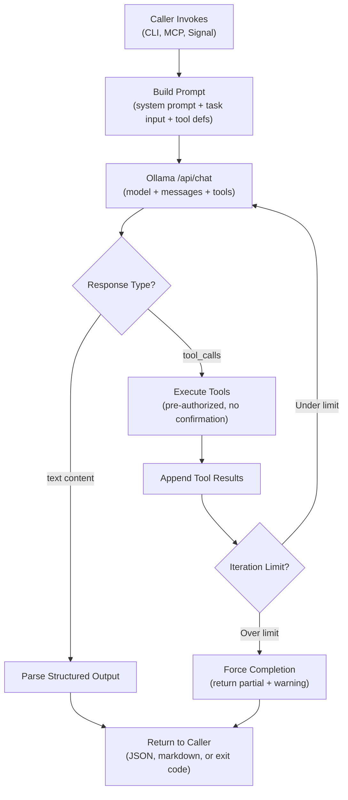
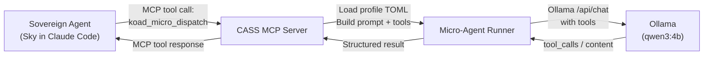
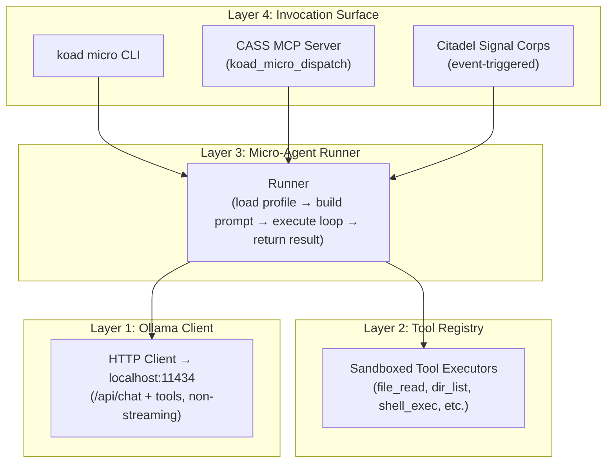

## Purpose

Architecture and implementation guide for building **headless Ollama-powered micro-agents** — lightweight local models that perform discrete tasks when invoked by **CLI commands**, **scripts**, or **Sovereign Agents** (body+ghost tethered KoadOS agents like Sky, Tyr, and Vigil). These micro-agents do not converse with humans in chat form. They receive structured input, execute tool-augmented work, and return structured output.

This page covers the invocation contract, the headless agent loop, tool design for autonomous execution, integration with the Citadel/CASS stack, and a concrete implementation plan.

---

## 1. The Two Agent Classes in KoadOS

KoadOS runs two fundamentally different kinds of agents. This guide is about the second.

| **Aspect** | **Sovereign Agent** | **Micro-Agent** |
| --- | --- | --- |
| **Examples** | Sky, Tyr, Vigil | Event Router, Issue Constructor, Context Distiller, Scribe |
| **Model tier** | Cloud frontier (Gemini, Claude, GPT) or large local (14B+) | Small local (1B–4B via Ollama) |
| **Interface** | Interactive — AI CLI with human-in-the-loop (Gemini CLI, Claude Code, Codex) | Headless — no human interaction during execution |
| **Boot model** | Body/Ghost — `koad-agent` prepares shell, human launches AI CLI | Invoked programmatically — CLI command, script, MCP tool call, or Sovereign dispatch |
| **Lifecycle** | Long-lived session (minutes to hours) | Short-lived task (seconds to low minutes) |
| **Citadel integration** | Full — Personal Bay, CASS memory, heartbeat, session tethering | Lightweight — optional bay, optional CASS, stateless by default |
| **Identity** | Rich ghost config (identity TOML, instructions page, memory scope) | Minimal — task-specific system prompt, no persistent identity required |
| **Confirmation** | Human approves destructive actions | Pre-authorized — caller defines permission scope at invocation |

### Why micro-agents matter

Sovereign Agents (Sky, Tyr) are expensive — they consume cloud API tokens, hold long context windows, and require human attention. Micro-agents handle the **grunt work** that doesn't need a frontier model:

- A Sovereign Agent dispatches a micro-agent to distill a 50-file directory into a context summary
- A CLI command invokes a micro-agent to construct a GitHub issue from a task description
- A cron job triggers a micro-agent to index new knowledge entries into the archive
- A CASS MCP tool delegates to a micro-agent for structured memory extraction

The micro-agent runs locally on Ollama, costs zero API tokens, finishes in seconds, and returns structured output the caller can consume immediately.

---

## 2. Invocation Patterns

Micro-agents are called, not conversed with. There are four invocation patterns, ordered by complexity:

### Pattern A: Direct CLI Command

The simplest pattern. A shell command invokes the micro-agent, passes input, receives output.

```bash
# Invoke a micro-agent from the command line
koad micro run context-distiller --input ./src/ --output summary.md

# Pipe content through a micro-agent
cat error.log | koad micro run log-analyzer --format json

# One-shot task with structured output
koad micro run issue-constructor \
  --title "Fix auth timeout" \
  --context "$(cat AGENTS.md)" \
  --format github-issue
```

**Contract:** stdin/args in → stdout/file out. Exit code 0 = success. Non-zero = failure with stderr diagnostics.

### Pattern B: Sovereign Agent Dispatch (MCP Tool)

A Sovereign Agent (e.g., Sky running in Claude Code) invokes a micro-agent through the **CASS MCP server**. The micro-agent appears as a native tool in the Sovereign's tool surface.

```
[Sky's Claude Code session]
User: "Summarize the src/engine/ directory before we refactor."

Sky thinks: I'll use the context-distiller micro-agent for this.
Sky calls tool: koad_micro_dispatch({
  agent: "context-distiller",
  input: { path: "./src/engine/", depth: 2, max_tokens: 2000 },
  output_format: "markdown"
})

→ Micro-agent runs headlessly via Ollama
→ Returns structured summary to Sky's context
→ Sky continues working with the distilled context
```

**Contract:** The CASS MCP server exposes a `koad_micro_dispatch` tool. The Sovereign Agent calls it like any other MCP tool. The micro-agent executes headlessly and returns the result to the Sovereign's conversation.

### Pattern C: Script / Automation Trigger

A cron job, Git hook, file watcher, or Citadel event triggers a micro-agent.

```bash
# Git post-commit hook — auto-generate commit summary
#!/bin/bash
git diff HEAD~1 | koad micro run commit-summarizer >> .koad-os/session-log.md

# Cron job — nightly knowledge indexing
0 3 * * * koad micro run knowledge-indexer --source ~/.koad-os/journals/

# File watcher — index new documents on arrival
inotifywait -m ~/projects/ -e create | while read path action file; do
  koad micro run file-indexer --file "$path$file"
done
```

**Contract:** Fire-and-forget or fire-and-capture. The caller doesn't interact with the micro-agent during execution.

### Pattern D: Citadel Signal Dispatch (A2A-S)

The Citadel's Signal Corps dispatches a micro-agent in response to an internal event. This is the most integrated pattern — fully automated, no human involvement.

```
[Citadel Event Bus]
Event: knowledge:new-entry (from Tyr's session)
→ Signal Corps routes to Knowledge Indexer micro-agent
→ Micro-agent embeds the entry, updates the knowledge graph
→ Emits knowledge:indexed event
→ Other agents pick up the indexed knowledge on next CASS hydration
```

**Contract:** The Citadel manages the full lifecycle — invocation, monitoring, result capture, error handling. The micro-agent is a stateless worker.

---

## 3. The Headless Agent Loop

The agent loop is the same fundamental pattern as an interactive wrapper, but with critical differences for headless operation: **no REPL, no confirmation prompts, no streaming display, bounded execution, structured I/O.**



### Key differences from interactive agents

| **Aspect** | **Interactive Agent (Codex, Claude Code)** | **Headless Micro-Agent** |
| --- | --- | --- |
| **Confirmation** | Human approves destructive tool calls | All tools pre-authorized at invocation time. Caller defines the permission scope. |
| **Output** | Streamed text to terminal | Structured return value (JSON, markdown, or raw text) to caller |
| **Iteration limit** | Soft limit, human can extend | Hard limit (e.g., 10 tool calls max). Exceeding = forced completion with partial results. |
| **Error handling** | Model explains error to human | Error returned as structured failure object. Caller decides retry strategy. |
| **Context window** | Managed across long session | Single-shot — fresh context per invocation. No history management needed. |
| **Timeout** | None (human-paced) | Hard timeout (e.g., 60s). Kill the loop if exceeded. |

### Pseudocode — headless agent loop

```tsx
// core/microAgent.ts — the headless agent loop

import { Ollama } from 'ollama';
import { ToolRegistry } from './tools/registry';

export interface MicroAgentConfig {
  model: string;              // e.g. 'qwen3:4b'
  systemPrompt: string;       // task-specific instructions
  tools: ToolRegistry;        // pre-authorized tool set
  maxIterations: number;      // hard cap on tool-call loops (default: 10)
  timeoutMs: number;          // hard timeout (default: 60000)
  outputFormat: 'json' | 'markdown' | 'text';  // expected return shape
  numCtx?: number;            // context window size (default: 8192)
}

export interface MicroAgentResult {
  success: boolean;
  output: unknown;            // parsed output in requested format
  toolCalls: number;          // how many tool calls were made
  durationMs: number;
  error?: string;             // populated on failure
}

export async function runMicroAgent(
  config: MicroAgentConfig,
  taskInput: string
): Promise<MicroAgentResult> {
  const ollama = new Ollama();
  const startTime = Date.now();
  let iterations = 0;

  const messages = [
    { role: 'system', content: config.systemPrompt },
    { role: 'user', content: taskInput }
  ];

  const toolDefs = config.tools.getDefinitions();

  while (iterations < config.maxIterations) {
    // Hard timeout check
    if (Date.now() - startTime > config.timeoutMs) {
      return {
        success: false,
        output: null,
        toolCalls: iterations,
        durationMs: Date.now() - startTime,
        error: 'TIMEOUT — exceeded ${config.timeoutMs}ms'
      };
    }

    const response = await ollama.chat({
      model: config.model,
      messages,
      tools: toolDefs,
      stream: false,
      options: { num_ctx: config.numCtx ?? 8192 }
    });

    messages.push(response.message);

    if (response.message.tool_calls?.length) {
      for (const call of response.message.tool_calls) {
        iterations++;
        try {
          // No confirmation — tools are pre-authorized
          const result = await config.tools.execute(
            call.function.name,
            call.function.arguments
          );
          messages.push({
            role: 'tool',
            tool_name: call.function.name,
            content: truncate(String(result), 4000)
          });
        } catch (err) {
          messages.push({
            role: 'tool',
            tool_name: call.function.name,
            content: `ERROR: ${err.message}`
          });
        }
      }
    } else {
      // Model returned text — task complete
      return {
        success: true,
        output: parseOutput(response.message.content, config.outputFormat),
        toolCalls: iterations,
        durationMs: Date.now() - startTime
      };
    }
  }

  // Max iterations exceeded — force return
  return {
    success: false,
    output: messages[messages.length - 1]?.content ?? null,
    toolCalls: iterations,
    durationMs: Date.now() - startTime,
    error: `MAX_ITERATIONS — hit ${config.maxIterations} tool calls`
  };
}
```

---

## 4. Ollama API for Headless Use

Ollama's `/api/chat` endpoint is the foundation. For headless micro-agents, the key settings differ from interactive use.

### Request format (headless-optimized)

```json
{
  "model": "qwen3:4b",
  "messages": [
    {"role": "system", "content": "You are a context distiller. Read the provided files and return a structured summary. Output ONLY valid JSON. Do not converse."},
    {"role": "user", "content": "{\"task\": \"summarize\", \"files\": [\"src/agent.ts\", \"src/tools/registry.ts\"]}"}
  ],
  "stream": false,
  "tools": [
    {
      "type": "function",
      "function": {
        "name": "file_read",
        "description": "Read the contents of a file at a given path",
        "parameters": {
          "type": "object",
          "required": ["path"],
          "properties": {
            "path": {"type": "string", "description": "Path to the file"}
          }
        }
      }
    }
  ],
  "options": {
    "num_ctx": 8192,
    "temperature": 0.1,
    "num_predict": 2048
  }
}
```

### Headless-specific settings

| **Setting** | **Value** | **Why** |
| --- | --- | --- |
| `stream` | `false` | No human watching — wait for complete response. Simpler code, no chunk assembly. |
| `temperature` | `0.1` – `0.3` | Micro-agents need deterministic, structured output. Low temp reduces hallucination. |
| `num_ctx` | `8192` – `16384` | Short tasks don't need 128K. Smaller context = faster inference on CPU. |
| `num_predict` | `1024` – `4096` | Cap output length. Prevents runaway generation from confused small models. |

### Model selection for micro-agents

| **Model** | **Tool Calling** | **Best For** | **Laptop (Io) Speed** |
| --- | --- | --- | --- |
| **Qwen3 4B** ⭐ | Native — trained for tool calling | General micro-agent tasks, structured output, tool-heavy workflows | ~15–30 tok/s CPU |
| **Gemma 3 4B** | Via Ollama injection (not native) | Summarization, content generation, 128K context tasks | ~15–30 tok/s CPU |
| **orieg/gemma3-tools:4b** | Community Modelfile with tool template | Gemma 3 with tool-calling template — test if Gemma tools are needed | ~15–30 tok/s CPU |
| **Qwen2.5 Coder 7B** | Native | Code-aware tasks — issue construction, code review, diff analysis | ~10–20 tok/s CPU |
| **Llama 3.2 1B** | Limited | Ultra-fast routing, log parsing, classification — no complex reasoning | ~50+ tok/s CPU |

<aside>
⚠️

**Gemma 3 4B does NOT support tools natively** in Ollama's OpenAI-compatible API. The stock `gemma3:4b` model returns `"does not support tools"` when called via `/v1/chat/completions` (which Codex `--oss` uses). For tool-calling micro-agents, **use Qwen3 4B** or the community `orieg/gemma3-tools` variant. Gemma 3 is still excellent for non-tool tasks (summarization, generation) called via the native `/api/chat` endpoint with prompt-injected instructions.

</aside>

---

## 5. System Prompts for Headless Agents

Small models need highly constrained system prompts. The key difference from interactive agents: **no conversation, no explanation, structured output only.**

### Template — headless micro-agent system prompt

```
You are a {AGENT_ROLE}. You execute tasks autonomously and return structured results.

Rules:
- Use tools to gather information. Never fabricate file contents or data.
- Return your final answer as {OUTPUT_FORMAT} only. No preamble, no explanation.
- If a tool call fails, try ONE alternative approach. If that fails, return an error result.
- Do not ask questions. Do not request clarification. Work with what you have.
- Stay within scope: {SCOPE_CONSTRAINT}

Working directory: {CWD}
```

### Example — Context Distiller

```
You are a context distiller. You read source files and produce concise structured summaries.

Rules:
- Use file_read and directory_list to explore the target path.
- Return your summary as a JSON object with keys: "overview", "files" (array of {path, purpose, key_exports}), "dependencies", "patterns".
- Output ONLY the JSON object. No markdown fences, no commentary.
- If a file cannot be read, skip it and note it in an "errors" array.
- Do not read more than 20 files. Prioritize by relevance.

Working directory: /home/ian/projects/koad-os
```

### Example — Issue Constructor

```
You are a GitHub issue constructor. Given a task description and relevant context, you produce a well-structured GitHub issue body.

Rules:
- Use file_read to examine referenced files for accurate context.
- Return a JSON object with keys: "title", "body" (markdown), "labels" (array), "priority" (P0-P3).
- The body must include: Problem Statement, Proposed Solution, Acceptance Criteria, and References.
- Output ONLY the JSON object.
- Do not fabricate code snippets — quote real code from files you've read.

Working directory: /home/ian/projects/koad-os
```

---

## 6. Tool Design for Autonomous Execution

Micro-agent tools must be **safe for unsupervised execution**. The tool set is scoped per micro-agent — a Context Distiller gets read-only tools, an Issue Constructor gets read + write, etc.

### Tool tiers by permission level

| **Tier** | **Tools** | **Risk** | **Used By** |
| --- | --- | --- | --- |
| **Read-Only** | `file_read`, `directory_list`, `file_search`, `git_log`, `git_diff` | None — purely observational | Context Distiller, Log Analyzer, Code Reviewer |
| **Write-Scoped** | `file_write` (sandboxed to output dir), `memory_save` | Low — writes to designated paths only | Issue Constructor, Knowledge Indexer, Scribe |
| **Shell-Scoped** | `shell_exec` (allowlist of commands) | Medium — restricted command set | Build Runner, Test Executor |
| **Full Access** | `shell_exec` (unrestricted), `file_write` (anywhere) | High — Sovereign-level. Only for trusted, Tyr-approved agents. | Reserved for Sovereign Agents, not micro-agents |

### Sandbox enforcement

Micro-agents operate under the **Sanctuary Rule** — they cannot access paths outside their permitted scope. Enforcement happens at the **tool executor level**, not the model level (the model can *ask* for anything; the executor rejects unauthorized requests).

```tsx
// tools/sandboxedFileRead.ts
import fs from 'fs/promises';
import path from 'path';

export function createSandboxedFileRead(allowedPaths: string[]) {
  return {
    definition: {
      type: 'function',
      function: {
        name: 'file_read',
        description: 'Read a file within the permitted scope',
        parameters: {
          type: 'object',
          required: ['path'],
          properties: {
            path: { type: 'string', description: 'File path to read' }
          }
        }
      }
    },
    execute: async (args: { path: string }) => {
      const resolved = path.resolve(args.path);
      const allowed = allowedPaths.some(p => resolved.startsWith(path.resolve(p)));
      if (!allowed) {
        return `DENIED: ${resolved} is outside permitted scope`;
      }
      const content = await fs.readFile(resolved, 'utf-8');
      return content.length > 6000
        ? content.slice(0, 6000) + '\n... [truncated at 6000 chars]'
        : content;
    }
  };
}
```

---

## 7. Micro-Agent Registry & Definitions

Each micro-agent is defined as a **task profile** — a named configuration that specifies model, system prompt, tool set, permissions, and output contract. These profiles live in `~/.koad-os/config/micro-agents/`.

### Profile format (TOML)

```toml
# ~/.koad-os/config/micro-agents/context-distiller.toml

[agent]
name = "context-distiller"
description = "Reads source files and produces structured context summaries"
model = "qwen3:4b"

[execution]
max_iterations = 10       # max tool call rounds
timeout_ms = 45000        # 45 second hard timeout
temperature = 0.1
num_ctx = 16384
num_predict = 4096
output_format = "json"    # json | markdown | text

[tools]
allowed = ["file_read", "directory_list", "file_search"]
tier = "read-only"        # read-only | write-scoped | shell-scoped

[sandbox]
allowed_paths = ["$CWD"]  # $CWD expands to caller's working directory
denied_paths = [".env", "secrets/", ".koad-os/config/"]

[prompt]
system = """
You are a context distiller. You read source files and produce concise structured summaries.
Return ONLY a JSON object with: overview, files[], dependencies, patterns.
Do not converse. Do not explain. Output JSON only.
"""
```

```toml
# ~/.koad-os/config/micro-agents/issue-constructor.toml

[agent]
name = "issue-constructor"
description = "Constructs well-structured GitHub issues from task descriptions"
model = "qwen2.5-coder:7b"

[execution]
max_iterations = 8
timeout_ms = 30000
temperature = 0.2
num_ctx = 8192
num_predict = 2048
output_format = "json"

[tools]
allowed = ["file_read", "directory_list", "git_log", "git_diff"]
tier = "read-only"

[sandbox]
allowed_paths = ["$CWD"]
denied_paths = [".env", "secrets/"]

[prompt]
system = """
You are a GitHub issue constructor. Given a task description, produce a structured issue.
Return ONLY a JSON object with: title, body (markdown), labels[], priority (P0-P3).
Use tools to read relevant source files for accurate context. Do not fabricate.
"""
```

---

## 8. Integration with Sovereign Agents

The most powerful pattern: a Sovereign Agent (Sky running in Claude Code) dispatches micro-agents as **cognitive offload** — delegating mechanical tasks to local models while preserving her context window for high-level reasoning.

### Via CASS MCP Server

The CASS MCP server exposes a `koad_micro_dispatch` tool that any Sovereign Agent can call:

```json
{
  "type": "function",
  "function": {
    "name": "koad_micro_dispatch",
    "description": "Dispatch a task to a headless local micro-agent. Returns structured output.",
    "parameters": {
      "type": "object",
      "required": ["agent", "input"],
      "properties": {
        "agent": {
          "type": "string",
          "description": "Micro-agent profile name (e.g. context-distiller, issue-constructor)"
        },
        "input": {
          "type": "string",
          "description": "Task input — structured JSON string or natural language task description"
        },
        "output_format": {
          "type": "string",
          "enum": ["json", "markdown", "text"],
          "description": "Desired output format (default: json)"
        },
        "cwd": {
          "type": "string",
          "description": "Working directory for the micro-agent (default: caller's cwd)"
        }
      }
    }
  }
}
```

### Dispatch flow



### Example interaction

```
[Sky's session — working on a refactor]

Sky: I need to understand the engine module before restructuring it.
     *calls koad_micro_dispatch(agent: "context-distiller", input: "./src/engine/")*

     [Micro-agent runs headlessly for ~8 seconds]
     [Reads 12 files via file_read tool]
     [Returns JSON summary]

Sky: Got it. The engine has 4 sub-modules: identity, storage_bridge, 
     heartbeat, and sandbox. storage_bridge is the largest at 400 lines.
     Now I'll restructure based on this map...
```

The Sovereign Agent's context window receives only the **distilled output** (maybe 500 tokens), not the raw file contents (potentially 20,000+ tokens). This is the core value proposition.

### Direct invocation (without CASS)

If the Citadel is offline, Sovereign Agents can invoke micro-agents directly via shell:

```bash
# In Claude Code, the Sovereign Agent runs:
koad micro run context-distiller --input ./src/engine/ --format json
```

This requires shell tool access but maintains **Citadel independence** — micro-agents work regardless of Citadel state.

---

## 9. The `koad micro` CLI Surface

The CLI is the primary human-facing interface for micro-agents. It's also the entry point for scripts and automation.

```bash
# Run a registered micro-agent
koad micro run <agent-name> [--input <path-or-text>] [--format json|md|text] [--timeout 30s]

# List available micro-agent profiles
koad micro list

# Show a micro-agent's profile and capabilities
koad micro info <agent-name>

# Test a micro-agent with dry-run (shows prompt + tools, doesn't call Ollama)
koad micro dry-run <agent-name> --input <path-or-text>

# Run an ad-hoc micro-agent (no profile — specify everything inline)
koad micro exec --model qwen3:4b --tools file_read,directory_list \
  --prompt "Summarize this codebase" --input ./src/
```

### Return format

All `koad micro run` commands return a structured envelope:

```json
{
  "agent": "context-distiller",
  "model": "qwen3:4b",
  "success": true,
  "output": { ... },
  "meta": {
    "tool_calls": 8,
    "duration_ms": 7420,
    "tokens_used": 3200
  }
}
```

Callers parse `output` for the actual result. `meta` is diagnostic. Exit code is 0 on success, 1 on failure.

---

## 10. Architecture — Four Layers



### Layer 1: Ollama Client

Thin HTTP client. Non-streaming for headless use. Handles the `/api/chat` request/response cycle. Uses the `ollama` npm package or raw `fetch`.

### Layer 2: Sandboxed Tool Registry

Each micro-agent profile specifies which tools it can use and which paths it can access. The registry creates sandboxed executors at invocation time based on the profile's `[tools]` and `[sandbox]` config.

### Layer 3: Micro-Agent Runner

The core loop from Section 3. Loads a profile TOML, constructs the prompt, runs the headless agent loop, parses the output, returns the structured result. Stateless — no memory between invocations unless explicitly using CASS.

### Layer 4: Invocation Surface

Three entry points, same runner underneath:

- **`koad micro` CLI** — human or script invocation
- **CASS MCP `koad_micro_dispatch`** — Sovereign Agent invocation
- **Citadel Signal Corps** — event-driven invocation

---

## 11. Micro-Agent Fleet — Starter Roster

Based on the KoadOS Cognitive Enhancement research and Scribe's role definition:

| **Micro-Agent** | **Model** | **Purpose** | **Tool Tier** | **Priority** |
| --- | --- | --- | --- | --- |
| **Context Distiller** (Scribe-class) | Qwen3 4B | Reads file trees and produces structured context summaries for Sovereign Agents | Read-only | v0.1 |
| **Issue Constructor** | Qwen2.5 Coder 7B | Generates well-structured GitHub issues from task descriptions + source context | Read-only | v0.1 |
| **Commit Summarizer** | Qwen3 4B | Produces structured commit messages or session summaries from diffs | Read-only | v0.1 |
| **Knowledge Indexer** | Qwen3 4B | Extracts entities, relationships, and embeddings from documents for the Knowledge Archive | Write-scoped | v0.2 |
| **Log Analyzer** | Llama 3.2 1B | Parses error logs and returns structured diagnostics (error type, stack trace, suggestion) | Read-only | v0.2 |
| **Event Router** | Llama 3.2 1B | Classifies incoming Citadel events and routes them to the correct handler | None (pure inference) | v0.3 |
| **EndOfWatch Generator** | Qwen3 4B | Produces structured EndOfWatch summaries from session logs during Brain Drain | Read-only | v0.3 |

---

## 12. Implementation Plan

### Phase 0: Validate Tool Calling (Now)

- [ ]  Pull `qwen3:4b` on Io — `ollama pull qwen3:4b`
- [ ]  Test raw tool calling via `curl` against Ollama's native `/api/chat` endpoint with a `file_read` tool definition
- [ ]  Test via Codex `--oss`: `codex --oss --model qwen3:4b` (if tool support works)
- [ ]  Compare Qwen3 4B vs Gemma 3 4B (non-tool prompt-injection approach) for structured output reliability
- [ ]  Test `orieg/gemma3-tools:4b` if Gemma tool support is desired

### Phase 1: Minimal Headless Runner (v0.1)

- [ ]  Scaffold TypeScript project: `packages/micro-runner/`
- [ ]  Implement Ollama client (non-streaming, `/api/chat` with tools)
- [ ]  Implement sandboxed tool executors: `file_read`, `directory_list`, `file_search`
- [ ]  Implement headless agent loop with hard timeout + iteration limit
- [ ]  Implement TOML profile loader
- [ ]  Build `koad micro run` CLI entry point
- [ ]  Create first three profiles: Context Distiller, Issue Constructor, Commit Summarizer
- [ ]  End-to-end test: `koad micro run context-distiller --input ./src/`

### Phase 2: Sovereign Integration (v0.2)

- [ ]  Expose `koad_micro_dispatch` as a CASS MCP tool
- [ ]  Add `shell_exec` (sandboxed, allowlisted commands) and `file_write` (scoped) tools
- [ ]  Create Knowledge Indexer and Log Analyzer profiles
- [ ]  Implement structured JSON output validation (schema enforcement on micro-agent responses)
- [ ]  Implement retry logic — if output parsing fails, re-prompt with correction hint (1 retry max)

### Phase 3: Citadel Integration (v0.3)

- [ ]  Wire micro-agents to Citadel Signal Corps for event-driven dispatch
- [ ]  Implement Event Router and EndOfWatch Generator profiles
- [ ]  Add telemetry — micro-agent invocations logged to CASS L2 episodic store
- [ ]  Implement `koad micro list` and `koad micro info` CLI commands
- [ ]  Concurrent model management — verify Ollama handles multiple simultaneous micro-agent calls

### Phase 4: Hardening & Rust Port (v1.0)

- [ ]  Port micro-agent runner to Rust (aligned with Citadel codebase)
- [ ]  Integrate with `koad-agent` boot flow — Sovereign ghosts auto-discover available micro-agents
- [ ]  Add micro-agent health monitoring to Tyr's bay dashboard
- [ ]  Document all profiles and write contributor guide for adding new micro-agents

---

## 13. Key Design Decisions

| **Decision** | **Options** | **Recommendation** |
| --- | --- | --- |
| Default micro-agent model | Qwen3 4B vs Gemma 3 4B vs Qwen2.5 Coder 7B | **Qwen3 4B** — native tool calling, trained for structured output. Gemma 3 4B for non-tool tasks. |
| Communication protocol | Direct Ollama HTTP vs MCP-only vs Both | **Both** — direct HTTP for the runner internals, MCP for Sovereign Agent dispatch. |
| State between invocations | Stateless vs Session memory vs CASS-backed | **Stateless by default.** Opt-in CASS memory for agents that need it (Knowledge Indexer). |
| Output enforcement | Trust the model vs JSON schema validation vs Retry on parse failure | **Validate + 1 retry.** If first output fails to parse, re-prompt with "Your output was not valid JSON. Return ONLY JSON." One retry, then fail. |
| Profile storage | TOML files vs Database vs Hardcoded | **TOML files** in `~/.koad-os/config/micro-agents/`. Consistent with KoadConfig. Auto-scanned. |
| Implementation language (v0.1) | TypeScript vs Python vs Rust | **TypeScript** — fastest to prototype, `ollama` npm package, aligns with Skylinks stack. Port to Rust for v1.0. |
| Micro-agent identity | Full ghost config vs Lightweight profile vs No identity | **Lightweight profile** — micro-agents don't need Personal Bays, heartbeats, or rich identity. Task profile TOML is sufficient. |

---

## 14. Relationship to Existing KoadOS Architecture

### Micro-Swarm Hangar

The Citadel's planned **Micro-Swarm Hangar** module is the eventual home for micro-agent fleet management. What this guide describes is the **internal architecture of each micro-agent** and the **invocation patterns** — the Hangar is the higher-level orchestration layer that deploys, monitors, and manages the fleet.

### CASS Integration Points

- **`koad_micro_dispatch`** MCP tool — primary Sovereign Agent integration
- **`koad_intel_commit`** — micro-agents can write findings to CASS L2 if their profile permits
- **Signal Corps events** — micro-agent completion events feed back into the Citadel event bus

### Comparison to Claude Code Subagents / Codex Multi-Agents

Both Claude Code and Codex CLI now support **sub-agent definitions** natively (Claude's custom subagents, Codex's `[agents]` config). These are conceptually similar — a main agent delegates to a specialized sub-agent. The difference:

- **CLI sub-agents** run on the same cloud model, in isolated context windows. Good for maintaining context separation but still consume API tokens.
- **KoadOS micro-agents** run on **local Ollama models**. Zero API cost, fully sandboxed, with different capability profiles per model.

The two approaches are complementary. A Sovereign Agent might use both: Claude Code subagents for tasks that need frontier reasoning, and KoadOS micro-agents (via MCP) for tasks that need speed and zero cost.

---

## 15. Quick-Start — Test Right Now

While Gemma 3 4B downloads (it's still useful for non-tool tasks), pull Qwen3 4B and test the tool-calling pipeline:

```bash
# Pull the tool-calling model
ollama pull qwen3:4b

# Test raw tool calling with curl
curl http://localhost:11434/api/chat -d '{
  "model": "qwen3:4b",
  "messages": [
    {"role": "system", "content": "You are a file reader assistant. Use the file_read tool to read files the user asks about. Return only the file contents summary."},
    {"role": "user", "content": "What is in ./package.json?"}
  ],
  "stream": false,
  "tools": [{
    "type": "function",
    "function": {
      "name": "file_read",
      "description": "Read contents of a file at the given path",
      "parameters": {
        "type": "object",
        "required": ["path"],
        "properties": {
          "path": {"type": "string", "description": "File path to read"}
        }
      }
    }
  }],
  "options": {"num_ctx": 8192, "temperature": 0.1}
}'
```

If the response includes `tool_calls` with `file_read` and a sensible `path` argument, the pipeline works. If not, the model isn't reliable for tool-calling micro-agents and you should evaluate `qwen2.5-coder:7b` as the next candidate.